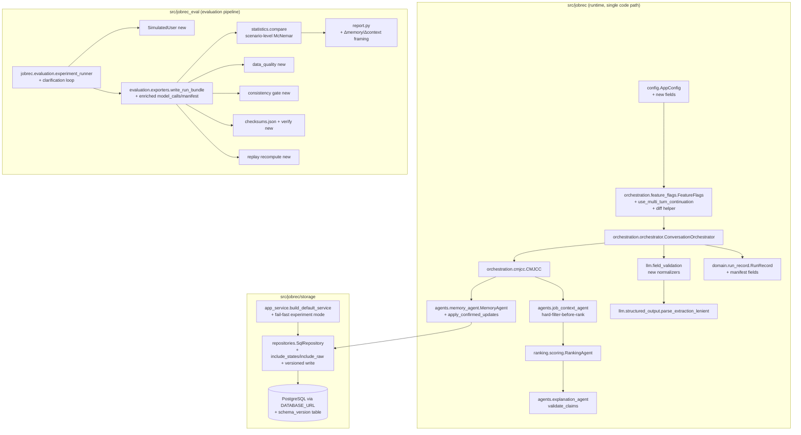

# Design Document: CMJCC Experiment Readiness

## Overview

This design turns the outstanding "Code Completion Checklist" (Requirements 4–32) into
concrete, incremental changes to the **existing** CMJCC codebase. It is a completion /
hardening effort, not a rebuild. Every change below extends an existing module or class;
no pipeline is forked and no parallel implementation is introduced.

**What changes**

- `MemoryAgent` gains an explicit long-term write-back operation (`apply_confirmed_updates`).
- `FeatureFlags` gains a `use_multi_turn_continuation` field so `one_shot` and `no_memory`
  are genuinely distinct, plus a helper to diff two flag sets for ablation attribution.
- `jobrec_eval.statistics.compare()` moves task-success McNemar pairing to the **scenario**
  level and reports scenario/run/repeat/pair counts.
- A new `SimulatedUser` + clarification dialogue loop in `jobrec_eval` makes
  clarification-dependent scenarios run end-to-end.
- A new field-validation/normalization module hardens LLM-extracted fields (salary,
  enums, skills, location, deadline) with repair → retry → rule fallback and never drops a
  stated constraint.
- `build_default_service` gains **fail-fast** behaviour in experiment/production mode, plus
  a lightweight migration-version table and restart recovery.
- New failure-path tests and metrics ensure grounding/handoff numbers are never trivially
  `1.000`.
- P1/P2 items enrich the run manifest, complete the SQL run-detail parameters, add
  extraction-source/retrieval metrics, a consistency gate, a unified checksum manifest, a
  data-quality validator, replay recomputation, structured logging, performance tests, a CI
  gate, and a freeze procedure.

**What is preserved (non-negotiable, Requirement 31)**

- **Single code path** — all variants differ only by `FeatureFlags` on the shared
  `ConversationOrchestrator` / `CMJCC` path.
- **Hard-filter-before-rank** — `JobContextAgent.evaluate` → `RankingAgent.rank` ordering is
  unchanged; hardening never lets a hard-violating job into `selected_job_ids`.
- **Evidence-bound claims** — every `ResponseClaim` still resolves to a registered
  `EvidenceItem`; `ExplanationAgent.validate_claims` remains the gate.
- **Deterministic mode is primary** — new logic is exercised first in deterministic mode;
  hybrid (`gpt-5.5`) remains an add-on with rule fallback.
- **PostgreSQL via `DATABASE_URL`** — `SqlRepository` remains the production store; the only
  change is refusing silent in-memory fallback in experiment mode.
- **The 68 existing tests keep passing** — changes are additive; the `FeatureFlags` table
  change and the `statistics.compare` change are the only behavioural edits to existing code
  and both are covered by updated/added tests.

## Architecture



**Where each requirement lands**

| Req | Primary module(s) | Nature of change |
|-----|-------------------|------------------|
| R4  | `agents/memory_agent.py`, `orchestration/cmjcc.py`, `storage/repositories.py` | new `apply_confirmed_updates`, wire-in, versioned persist |
| R5,R32 | `orchestration/feature_flags.py`, `config.py`, `domain/run_record.py` | new flag + diff helper + flag matrix + logging |
| R6  | `jobrec_eval/statistics.py` | scenario-level McNemar pairing + counts |
| R7  | `jobrec_eval/` (new `simulated_user.py`), `jobrec/evaluation/experiment_runner.py` | dialogue loop runner |
| R8  | `jobrec/llm/field_validation.py` (new), `orchestration/orchestrator._extract`, `cmjcc._as_float` | per-field validators |
| R9  | `app_service.py`, `storage/db.py`, `storage/models.py`, `storage/repositories.py` | fail-fast, migration table, restart recovery |
| R10 | `tests/`, `jobrec_eval/metrics_extra.py` | failure-path tests + rates |
| R11–R18, R25–R30 | manifest builder, `repositories.get_run`, eval modules, CI, freeze | additive |
| R19–R24 | `tests/` suites | test-only |

## Components and Interfaces

### R4 — CandidateState long-term memory write-back

**Module:** `src/jobrec/agents/memory_agent.py` (extend `MemoryAgent`).

New method:

```python
def apply_confirmed_updates(
    self,
    candidate: CandidateState,
    extraction: ExtractedPreferenceSet,
    conflicts: list[PreferenceConflict],
    now: datetime | None = None,
) -> CandidateState:
    """Return a NEW CandidateState version with confirmed long-term updates applied.

    Returns the SAME instance (no new version) when no preference resolves to a
    durable long-term write. Never mutates the input CandidateState.
    """
```

**Resolution rule (which preferences write long-term).** A preference `p` from
`extraction.preferences` is written to long-term memory iff ALL hold:

1. `p.confirmation_status == ConfirmationStatus.CONFIRMED` (never `inferred`/`unconfirmed`/
   `rejected`). `inferred` is admitted only if `config.memory.inference_to_long_term` is
   true (default false).
2. Resolved scope is `long_term`. Resolution combines `p.persistence_scope` and
   `p.temporal_scope`:
   - `temporal_scope == "long_term"` → `long_term` (explicit "from now on").
   - `temporal_scope in {"current_search"}` → `active_search` (explicit "this time only") —
     **never** long-term, even if `persistence_scope` says otherwise.
   - `temporal_scope in {"session","unknown"}` → fall back to `p.persistence_scope`.
   The mapping lives in a small pure helper `resolve_scope(p) -> PersistenceScope`.
3. `p.confidence >= config.memory.clarification_confidence_threshold` (default 0.72).
4. `p.field_name` is NOT in the set of fields whose conflict resolution is anything other
   than `override` (per R4.11 — see below).

**"From now on" vs "this time only" detection.** `temporal_scope` already exists on
`ExtractedPreference` (`current_search|session|long_term|unknown`). Two producers set it:
- **Rule extractor** (`agents/candidate_understanding.py`): add phrase cues —
  `from now on`, `always`, `going forward`, `in general`, `permanently` → `long_term`;
  `this time`, `just this search`, `for now`, `only this` → `current_search`. Cue tables live
  next to the existing extraction rules.
- **LLM (hybrid)**: `parse_extraction_lenient` already parses a `temporal_scope` field from
  the model JSON; the extraction prompt in `prompts.py` is amended to instruct the model to
  emit it. No parser change needed.

**Write mechanics (per field).** For each writable preference:
- Map `field_name` → CandidateState attribute using the existing `_LIST_FIELDS` /
  `_SCALAR_FIELDS` tables (reused).
- Register a long-term `EvidenceItem` via `self.store.register_field(EvidenceSource.DIALOGUE
  or CLARIFICATION, ..., scope=PersistenceScope.LONG_TERM)` and collect its id (R4.4/R4.10).
- **Scalar field**: supersede the old `PreferenceValue` — set `is_active=False`,
  `effective_to=now` — and add a new active `PreferenceValue(value=..., evidence_ids=[ev],
  confirmation_status=CONFIRMED, persistence_scope=LONG_TERM, effective_from=now,
  is_active=True)`. Since `CandidateState` scalars are single `PreferenceValue|None`, the
  superseded value is retained inside `metadata["superseded"][field]` (append-only history)
  so the deactivated record and its `effective_to` are preserved (R4.3).
- **List field**: append the new active value; if the same logical value already exists,
  deactivate the prior entry (`is_active=False`, `effective_to=now`) and add the new one so
  history is explicit.
- Produce the new state via `candidate.model_copy(update={"version": candidate.version + 1,
  "updated_at": now, <field>: ...})` (R4.2 — immutable, incremented version).

**R4.11 conflict guard.** Before writing, intersect writable fields with conflicts whose
`resolution != "override"` (the existing `_classify_conflict` emits `ask_clarification`,
`use_current_for_search`, `merge_values`, etc. — none of which is `override`). For those
fields, skip the long-term write, keep the existing long-term value, and ensure the conflict
is recorded on `DialogueState.conflicts` (already handled by CMJCC).

**Wire-in (single code path).** In `CMJCC.run` (`orchestration/cmjcc.py`), after step 2
(conflict detection) and before returning, add:

```python
if self.flags.persist_confirmed_updates and self.flags.use_persistent_memory:
    updated = self.memory.apply_confirmed_updates(
        inp.candidate_state, inp.extracted_preferences, conflicts, now)
    if updated is not inp.candidate_state:
        candidate_state = updated
        log("memory_updated", "candidate_state_written",
            outputs=[f"{updated.candidate_id}:v{updated.version}"], rule="cmjcc.writeback")
```

`CMJCCOutput.candidate_state` then carries the new version; the orchestrator already
threads `cmjcc_out.candidate_state` forward, and `AppService.process_turn` already calls
`repo.save_turn(result, ...)` which calls `upsert_candidate_state` — the existing
`SqlRepository.upsert_candidate_state` is already versioned (writes a new
`CandidateStateVersion` row and bumps `Candidate.latest_version`). So **persistence needs no
new method**; write-back flows through the existing versioned upsert (R4.2, R4.8 storage).

**Cross-session inheritance (R4.6/R4.9).** `AppService.process_turn` loads the latest
`CandidateState` via `repo.get_candidate_state(candidate_id)`; a new session therefore reads
the updated long-term version. Values whose scope is not long-term never enter
`CandidateState`, so they cannot leak across sessions (they live only in `ActiveSearchState`
which is per-search). No API change; behaviour follows from the write-back rule.

### R5 + R32 — Genuinely distinct `one_shot` vs `no_memory`, and ablation attribution

**Module:** `src/jobrec/orchestration/feature_flags.py`.

Add one field to `FeatureFlags`:

```python
use_multi_turn_continuation: bool  # one_shot=False, all others=True
```

Semantics: when `False`, the orchestrator treats each turn independently — it does **not**
fold prior candidate turns even when they exist, and it resets per-turn working state. This
is the mechanism that makes `one_shot` a genuine single-turn condition, whereas `no_memory`
keeps the multi-turn agent workflow (CMJCC, handoffs, job-context) but forbids prior-dialogue
and persistent-memory access.

**Resolved flag matrix (authoritative):**

| variant | use_profile | use_current_turn | use_multi_turn_continuation | use_prior_dialogue | use_persistent_memory | persist_confirmed_updates | explicit_constraint_orchestration |
|---|---|---|---|---|---|---|---|
| `full`         | ✓ | ✓ | ✓ | ✓ | ✓ | ✓ | ✓ |
| `profile_only` | ✓ | ✗ | ✓ | ✗ | ✓ | ✗ | ✓ |
| `one_shot`     | ✓ | ✓ | **✗** | ✗ | ✗ | ✗ | ✓ |
| `no_memory`    | ✓ | ✓ | **✓** | ✗ | ✗ | ✗ | ✓ |
| `no_context`   | ✓ | ✓ | ✓ | ✓ | ✓ | ✓ | **✗** |

`one_shot` and `no_memory` now differ on exactly `use_multi_turn_continuation` (R5.3/R5.6).

**Orchestrator branch (single path).** In `orchestrator.process_turn`, the prior-dialogue
fold is already gated on `self.flags.use_prior_dialogue`. Add the continuation gate so that
under `one_shot` the multi-turn continuation is disabled explicitly:

```python
if self.flags.use_prior_dialogue and self.flags.use_multi_turn_continuation:
    extraction = self._merge_prior_dialogue(dialogue_state, extraction)
```

(Since `one_shot` already has `use_prior_dialogue=False`, the observable multi-turn state
difference is reinforced by the new flag and, importantly, the *resolved configuration and
logs* now differ — satisfying R5.4/R5.5/R5.7.)

**Config entries.** `MemoryConfig` gains `use_multi_turn_continuation: bool = True` so the
flag can be restricted by config (same "restrict but not expand" pattern as existing flags).
`FeatureFlags.from_config` reads it and, like the other flags, config may only turn it off.

**Logging resolved flags (R5.4).** `RunRecord` gains
`feature_flags: dict[str, Any] = Field(default_factory=dict)`; `_finish` populates it from
`dataclasses.asdict(self.flags)`. The run bundle's `resolved_config.yaml` already captures
config; the manifest (R11) also embeds resolved flags.

**Ablation-attribution helper (R32).** Add to `feature_flags.py`:

```python
def flag_diff(a: FeatureFlags, b: FeatureFlags) -> set[str]:
    """Return the set of behaviour-flag field names that differ (variant excluded)."""

MEMORY_FLAGS = {"use_prior_dialogue", "use_persistent_memory",
                "persist_confirmed_updates", "use_multi_turn_continuation"}
CONTEXT_FLAGS = {"explicit_constraint_orchestration"}
```

The variant-isolation assertion (R24, R32.1/2/7): `flag_diff(full, no_memory) ⊆ MEMORY_FLAGS`
and `flag_diff(full, no_context) ⊆ CONTEXT_FLAGS`, and no other flag differs. This helper is
consumed both by the test suite and by the eval consistency gate (R15/R32.7).

### R6 — Correct statistical unit for task success

**Module:** `src/jobrec_eval/statistics.py` (`compare`, add helper).

Replace the run-level McNemar pairing (currently pivots on
`["scenario_id","repeat_index"]`) with scenario-level pairing:

```python
def aggregate_scenario_success(run_metrics, variant, subset=None) -> pd.Series:
    """Collapse repeats to ONE binary per scenario for a variant.
    Rule: majority vote across repeats; ties (only possible with even repeats)
    resolve to the conservative 0 (not-success). Deterministic runs (repeat=1)
    are unaffected."""
```

In `compare`, when `metric == "task_success"`:
- build `base_bin = aggregate_scenario_success(run_metrics, base, subset)` and
  `other_bin` similarly, aligned on the intersection of scenario ids;
- `mc = mcnemar(base_bin, other_bin)`; `result["n_pairs"]` for task_success is the number of
  paired scenarios (== number of scenarios present in both variants), **not** runs (R6.1/6.3);
- add reporting fields to the result dict: `scenario_count`, `total_run_count`,
  `repeats_per_scenario`, `valid_pairs` (== n_pairs), `discordant_pairs` (== `mc["n_discordant"]`)
  (R6.4).

Because aggregation collapses duplicated deterministic repeats to a single binary,
`repeat_count` 1→3 does not change `n_pairs` and cannot shrink the p-value (R6.7/6.8). The
scenario-level bootstrap on continuous metrics (already scenario-paired via `_paired`) is
unchanged. Default deterministic `repeat_count` guidance stays 1 (R6.5); `ExperimentConfig`
default remains configurable for stochastic runs (R6.6).

### R7 — Evaluable clarification dialogue loop

**New module:** `src/jobrec_eval/simulated_user.py`.

```python
class SimulatedUser:
    """Answers clarification questions from a scenario reference."""
    def __init__(self, scenario: Scenario) -> None: ...
    def answer(self, clarification, asked_slots: set[str]) -> tuple[str, str] | None:
        """Return (utterance, slot) using scenario.acceptable_slots / profile /
        expected answer, or None if it cannot answer (forces termination)."""
```

The simulated user reads the scenario reference already present in `scenarios.py`
(`Scenario` with acceptable slots / profile / expected outcome) and maps a clarification's
`target_fields`/`reason_code` to a concrete answer utterance.

**Loop runner.** Extend `jobrec/evaluation/experiment_runner.py` `_run_one`: for scenarios
flagged clarification-dependent (scenario metadata `clarification_dependent: true`), replace
the fixed `for text in scenario["turns"]` loop with a dialogue loop:

```
turn = 0; asked = set()
process the initial user turn
while turn < max_turns:
    if response_type == recommendation or correct no_match: break (success/terminal)
    if response_type == clarification:
        answer = simulated_user.answer(clar, asked)
        if answer is None: break (cannot answer -> terminate)
        slot = answer.slot
        if slot in asked: record repeated_slot_guard; break   # R7.7
        asked.add(slot); feed answer as next turn
    else: break
    turn += 1
```

- **Termination conditions (R7.2):** recommendation success, correct no-match, `max_turns`
  reached, or failure/cannot-answer. `max_turns` from config (`ExperimentConfig.max_dialogue_turns:
  int = 6`) enforces the guard (R7.6).
- **Per-turn logging (R7.3):** each turn appends a record to `dialogue_trace.jsonl` in the
  run bundle with `{user_utterance, system_action, clarification_slot, extracted_value,
  state_version, termination_reason}`.
- **Repeated-slot guard (R7.7):** re-asking an answered slot records
  `event="repeated_slot"` and terminates the loop.
- **Necessary vs unnecessary (R7.4/7.5):** a clarification slot is `Necessary` if it appears
  in `scenario.acceptable_slots` (the reference says the answer is required to reach the
  correct outcome); otherwise `Unnecessary`. Efficiency score = number of `response_turns`
  to reach the correct outcome, with a penalty rule: a run that reaches a terminal state
  **without** asking a Necessary clarification receives `efficiency = worst` (i.e. it is
  never scored more efficient than a run that asked the necessary question). Implemented in
  `metrics_extra.py` as `clarification_efficiency(run_metrics)`.
- **Cross-variant `response_turns` (R7.8):** `response_turns` is recorded per run so
  variants that clarify vs guess produce differing values.

### R8 — LLM field-level validation and normalization

**New module:** `src/jobrec/llm/field_validation.py`.

```python
@dataclass
class FieldResult:
    field_name: str
    value: Any                 # normalized value (or None if unrecoverable)
    ok: bool
    warnings: list[str]        # structured reasons (R8.11)
    source: str                # "normalized" | "repaired" | "rule_fallback"

def normalize_salary(raw) -> dict:        # {min_salary,max_salary,currency,period}
def normalize_work_mode(raw) -> str|None  # enum-constrained
def normalize_experience_level(raw) -> str|None
def normalize_skills(raw) -> list[str]
def normalize_location(raw) -> str|None   # canonical via taxonomy
def normalize_deadline(raw) -> str|None   # ISO-8601 date
def validate_field(field_name, raw) -> FieldResult
def validate_extraction(pref_set) -> tuple[ExtractedPreferenceSet, list[FieldResult]]
```

- **Salary (R8.2/8.10):** accept `int|float` → `{min_salary=x, max_salary=x, currency=default,
  period=default}`; `str` (e.g. "RM50000", "50k-60k/month") → parse numeric range, currency
  symbol, and period; `dict` (e.g. `{amount, period}` or `{min, max, currency}`) → map keys.
  Reuses/absorbs the tolerant logic currently in `cmjcc._as_float`, which is then simplified
  to call `normalize_salary` so there is one salary parser.
- **Enums (R8.3):** `work_mode`, `experience_level` validated against the domain
  vocabularies (via `taxonomy.py` canonicalisation); unknown → warning + drop-to-fallback,
  never crash.
- **Skills (R8.4):** coerce scalar/CSV string/list to `list[str]` (canonical skill names).
- **Location (R8.5):** `taxonomy.canonical_location` (add if missing) → canonical string.
- **Deadline (R8.6):** parse common date forms to ISO date.
- **Robustness (R8.7):** every `normalize_*` is total — number/string/object/missing/
  wrong-type/invalid-enum all return a value-or-None + warnings without raising.

**Pipeline (R8.8/8.9).** Hook into `orchestrator._extract` right after
`parse_extraction_lenient`:
1. `validate_extraction(pref_set)` normalizes each preference's `normalized_value`.
2. On any `FieldResult.ok == False`: attempt **schema repair** (coerce obvious shape, e.g.
   wrap scalar), then **retry** the model once more (hybrid only, bounded by
   `config.llm.max_retries`), then **rule fallback** (`self.rule_extractor.extract(text)` for
   that field), emitting a warning/error log at each step.
3. **Never drop a stated constraint (R8.9):** if a field was present in raw output but cannot
   be normalized, the rule-extracted value (or the raw string) is preserved with
   `confirmation_status=UNCONFIRMED` and a warning, so it still reaches `ActiveSearchState`
   and, if hard, still filters.

**Metrics (R8.12).** `FieldResult.source` counts feed `jobrec_eval/metrics_extra.py`
`extraction_source_metrics` which, for hybrid runs, reports `schema_failure_rate`
(fraction of fields needing repair/retry) and `fallback_rate` (fraction using
`rule_fallback`).

### R9 — PostgreSQL persistence and restart recovery

**Fail-fast (R9.6).** `app_service.build_default_service` currently silently falls back to
`InMemoryRepository`. Change:

```python
def build_default_service(config, catalog_path=..., use_database=None,
                          require_db: bool | None = None) -> AppService:
    require_db = require_db if require_db is not None else _require_db_from_env(config)
    available = is_database_available()
    if require_db and not available:
        raise RuntimeError(ErrorCode.CATALOG_NOT_READY  # -> new DB_UNAVAILABLE code
            "experiment mode requires PostgreSQL (DATABASE_URL) but none is reachable")
    ...
```

`require_db` is true when `JOBREC_REQUIRE_DB=1` **or** `config.project.environment in
{"experiment","production"}`. Deterministic unit tests still pass `require_db=False`
explicitly. Add `ErrorCode.DB_UNAVAILABLE`.

**Restart recovery (R9.2–R9.5).** All state is already persisted through `SqlRepository`
(candidate versions, dialogue versions, decisions, evidence items, handoffs, evidence logs,
responses, run records). Recovery is achieved by rebuilding an `AppService` against the same
`DATABASE_URL` and calling the existing loaders:
- `get_candidate_state(candidate_id)` → latest version (preserves version history via
  `CandidateStateVersion` rows — R9.5);
- `get_latest_dialogue_state(session_id)` → resume the session (R9.3);
- `ActiveSearchState` is per-search and re-derived by CMJCC from the restored candidate +
  dialogue (no separate table needed); decisions/evidence/handoffs are reloadable via
  `get_run(..., include_states, include_evidence, include_handoffs)`.
- Evidence links stay valid because evidence ids are content-addressed and the
  `EvidenceItemRow` rows persist (R9.4).

**Migration versioning (R9.7).** Recommend the **lighter** option: a `schema_version` table
(single-row `{version: int, applied_at, description}`) managed by a tiny
`storage/migrations.py` with an ordered list of idempotent migration callables, rather than
adopting Alembic. Justification: the schema is small and created via
`Base.metadata.create_all`; the thesis needs a *recorded, reproducible* version, not a
full migration framework; Alembic would add tooling/config overhead disproportionate to a
frozen research prototype. `create_all` is extended to `ensure_schema_version(engine)` which
writes/upgrades the row.

**Recording versions (R9.8).** `RunRecord` gains `db_version: str | None` and
`migration_version: int | None`; `_finish` reads them from the repository (a new
`SqlRepository.versions() -> dict` returning server `version()` and `schema_version`). The
run manifest (R11) embeds both.

**Integration tests (R9.1/9.9).** New `tests/integration/test_pg_persistence.py` marked
`@pytest.mark.postgres`, using the existing `scripts/pg_local.sh` pattern (`pg_up` →
`pytest -m postgres` → `pg_down`) wired as a Make target `make test-pg` (single command).
Tests skip when no DB (unchanged behaviour for the 68-test default run).

### R10 — Failure-path tests for evidence grounding and handoffs

**Tests (new `tests/unit/test_failure_paths.py`, `tests/integration/test_failure_metrics.py`).**
Enumerated negatives:
- Invalid evidence id / missing source / claim referencing wrong field → `ExplanationAgent.
  validate_claims` drops or flags (support_status != supported) (R10.1/10.6).
- Unsupported salary/location/skill claim (evidence not registered) → flagged (R10.2).
- Schema-invalid handoff and handoff missing required fields → `AgentHandoff` validation
  fails; run not counted success (R10.3/10.7).
- Agent exception → orchestrator's existing `except` path produces `failure_code`,
  `success=False`; timeout-with-retry via `llm/retry.py`; partial failure with recovery via
  rule fallback (R10.4).
- Every such event logs an evidence-log/handoff entry with final status (R10.5).

**Injection.** A tiny `tests/support/fault_injection.py` provides: a provider that raises
`LLMTimeout` N times then succeeds; a claim factory with dangling evidence ids; a handoff
factory omitting required fields.

**Metrics (R10.8/10.9).** `metrics_extra.py` adds:
```python
def failure_detection_rate(run_metrics) -> float   # detected / injected
def recovery_success_rate(run_metrics) -> float     # recovered / recoverable
def grounding_rate(bundles) -> float                # supported claims / all claims
def handoff_success_rate(bundles) -> float
```
Because the failure-path scenario set contains genuine failures, `grounding_rate` and
`handoff_success_rate` are strictly `< 1.000` over that set (R10.9).

### R11 — Enriched model-call logs and full run manifest

- **Model calls (R11.1):** `LLMCallRecord` already has `purpose`, `latency_ms`,
  `provider`, `model`. Extend the bundle writer (`exporters.write_run_bundle`) to emit, per
  call, `request_params` (temperature, max_retries, timeout) and `response_metadata`
  (`parsed_ok`, token/finish info from `metadata`), reading from the existing record.
- **Manifest builder (R11.2/11.3):** new `jobrec/evaluation/manifest.py`
  `build_run_manifest(config, run_record, versions) -> dict` capturing commit hash
  (`git rev-parse`), Python & dependency versions (`importlib.metadata`), OS/CPU/memory
  (`platform`, `psutil` optional), API summary, and `config_hash`/`catalog_hash`/
  `prompt_hash` (already on `RunRecord`) plus resolved `feature_flags` and db/migration
  versions. Written as `run_manifest.json` in each run dir and aggregated in the experiment
  manifest.

### R12 — Run-detail API parameters in the SQL repository

`SqlRepository.get_run` currently ignores `include_states` and `include_raw_model_outputs`.
Implement:
- `include_states` → load `CandidateStateVersion` / `DialogueStateVersion` payloads for the
  run's session and attach under `out["states"]`.
- `include_raw_model_outputs` → load `ModelCallRow` payloads; apply **redaction** (R12.3)
  via a `redact(text)` helper that removes API keys/PII patterns and honours
  `config.logging.redact_candidate_text`.
- API tests (`tests/integration/test_run_detail_api.py`) exercise both params and redaction
  (R12.4).

### R13 — Extraction-source and fallback statistics

`FieldResult.source` (from R8) plus a per-field `extraction_method` (`rule`|`llm`) recorded
on each `ExtractedPreference.metadata` at extraction time. Persisted in
`extracted_preferences.json`. `metrics_extra.extraction_source_metrics` aggregates rule-vs-LLM
counts and fallback counts per variant and per scenario type (R13.1/13.2).

### R14 — Retrieval-layer evaluation

The orchestrator already builds a `RetrievalOutcome` (`result.retrieval_outcome`). Persist it
to `retrieval_results.json` with: initial pool, retrieval score, full-catalog-fallback count
(`expanded`/`expansion_reason`), pool size, retrieval latency (from
`component_latency_ms["retrieval"]`). Eval adds `retrieval_metrics(bundles)` computing
Recall@pool and relevant-job coverage against the relevance oracle (`relevance.py`), and
reports retrieval errors separately from ranking errors (R14.1/14.2).

### R15 + R32.7 — Pre-comparison configuration-consistency gate

New `jobrec_eval/consistency.py`:
```python
def check_consistency(manifests: list[dict]) -> ConsistencyReport
def require_consistent(manifests, target_flag_set: set[str]|None=None) -> None  # raises on mismatch
```
Verifies equality across compared runs of: catalog hash, scenario hash, prompt hash, model
settings, top-k, pool size, seed, commit hash (R15.1). For ablation pairs it additionally
asserts, using `feature_flags.flag_diff`, that only the target mechanism's flags differ
(R32.7). On mismatch, `report.py` stops before generating output (R15.2) and writes the
consistency flags into each run's manifest (R15.3).

### R16 — Unified checksums

New `jobrec/evaluation/checksums.py` `write_checksums(exp_dir) -> Path` producing
`checksums.json` (`{relative_path: sha256}`) over **all** input+output artifacts (supersedes
the current `.sha256`-of-`*.json`-only file). A verify command `jobrec-eval verify
<exp_dir>` (added to `jobrec_eval/cli.py`) recomputes and, on mismatch, prints the offending
artifact and exits non-zero (R16.1/16.2/16.3).

### R17 — Data-quality validation

New `jobrec_eval/data_quality.py` `validate_dataset(catalog, scenarios) -> list[Finding]`
checking: duplicate job/scenario ids; salary min>max; unknown currencies; invalid
`work_mode`/`experience_level`; expired deadlines; empty titles/skills/locations; each
scenario has a relevance label + hard-constraint reference where required; each no-match
scenario truly has no eligible job (evaluated via `JobContextAgent`). Emits a machine-readable
`data_quality_report.json` (R17.3) recording offending identifier + violation type (R17.4).

### R18 — Artifact replay and deterministic recomputation

New `jobrec/evaluation/replay_check.py`. Using `RunMode.REPLAY` + the saved
`model_calls.jsonl` (via existing `ReplayProvider`), re-run each saved deterministic run and
compute key-state hashes for: extracted slots, state versions, filtered jobs, ranking output,
explanation claims. Compare to the original (recompute from the saved bundle) and write
`replay_diff.json` recording any differences (R18.1–18.4). `jobrec_eval` can regenerate
statistics/reports from saved bundles (loaders already support this).

### R19–R24 — Dedicated test suites

| Req | Test file | Key cases |
|-----|-----------|-----------|
| R19 candidate memory | `tests/unit/test_memory_writeback.py` | long-term write, scope handling, versioning, cross-session inheritance |
| R20 constraint orchestration | `tests/unit/test_constraint_orchestration.py` | hard-filter, unknown policy, no-match diagnosis |
| R21 dialogue conflict | `tests/unit/test_dialogue_conflicts.py` | value mismatch, temporal override, scope mismatch |
| R22 explanation grounding | `tests/unit/test_explanation_grounding.py` | supported / unsupported / dropped claims |
| R23 agent handoff | `tests/unit/test_agent_handoff.py` | valid / schema-invalid / missing-field handoffs |
| R24 variant isolation | `tests/unit/test_variant_isolation.py` | distinct `FeatureFlags` per variant + `flag_diff` attribution |

### R25 — Ranking score-breakdown persistence

`RankedJob.features` (`RankingFeature` with `weighted_contribution`) already carries the
breakdown; it is persisted in `recommendation_decision.json`. Add
`jobrec_eval` `topk_contribution_table(bundles)` producing the per-feature top-k contribution
table (R25.1/25.2).

### R26 — Secret and configuration management

- API keys read only from env (`JOBREC_LLM_API_KEY/BASE_URL/MODEL`) in `remote_provider.py`;
  add a log filter ensuring keys are never logged (R26.1).
- Keep/extend `.env.example` and add `config/deterministic.yaml` + `config/hybrid.yaml`
  templates (R26.2).
- Startup validation: `validate_startup(config)` in `app_service` checks required config and
  (hybrid) presence of API env; fail fast with explicit error (R26.3/26.4).

### R27 — Structured JSON logging

New `jobrec/utils/observability.py` configuring a JSON logger emitting
`{run_id, session_id, scenario_id, variant, component, event, severity}`; severities
`warning|validation_error|system_failure` (R27.2). Per-run trace exported as
`log_trace.jsonl` in the bundle (R27.3).

### R28 — Performance tests

`tests/perf/test_latency.py` measures end-to-end and per-component latency (median, IQR, P95)
across catalog sizes 100/200/300 (subsampling the catalog) and reports LLM latency separately
from rule latency using `component_latency_ms` (R28.1–28.3).

### R29 — CI gate

Extend `.github/workflows/ci.yml`: jobs for unit tests, ruff lint, type-check, coverage,
deterministic smoke eval (`jobrec-eval run --variants full,no_memory,no_context --repeats 1`
on a tiny fixture), and data-quality/catalog validation. Any failure blocks release tagging
(R29.1/29.2).

### R30 — Code and version freeze

`scripts/freeze.sh`: create an annotated git tag, record commit hash, dependency lock
(`uv.lock`/`requirements.txt`), run instructions, DB schema dump, and a final manifest
referencing the frozen commit + lock (R30.1/30.2).

## Data Models

**`FeatureFlags` (feature_flags.py)** — add field:
```python
use_multi_turn_continuation: bool
```

**`AppConfig` additions (config.py):**
- `MemoryConfig.use_multi_turn_continuation: bool = True`
- `ExperimentConfig.max_dialogue_turns: int = 6`
- `ProjectConfig.environment` already exists; `{"experiment","production"}` now trigger
  fail-fast DB behaviour.

**`RunRecord` additions (run_record.py):**
```python
feature_flags: dict[str, Any] = Field(default_factory=dict)
db_version: str | None = None
migration_version: int | None = None
consistency_flags: dict[str, bool] = Field(default_factory=dict)
```

**Run manifest (`run_manifest.json`, new):** commit hash, python/deps, OS/CPU/mem/API,
`config_hash`, `catalog_hash`, `prompt_hash`, resolved `feature_flags`, `db_version`,
`migration_version`, `consistency_flags`.

**DB migration table (`storage/models.py`):**
```python
class SchemaVersion(Base):
    __tablename__ = "schema_version"
    id: Mapped[int] = mapped_column(primary_key=True, default=1)
    version: Mapped[int]
    description: Mapped[str]
    applied_at: Mapped[datetime]
```

**Salary normalized structure (field_validation.py):**
```python
{"min_salary": float|None, "max_salary": float|None,
 "currency": str, "period": str}   # period ∈ {year, month, hour}
```

**Superseded-value history (CandidateState.metadata):**
`metadata["superseded"][field] = [PreferenceValue(... is_active=False, effective_to=now)...]`.

## Correctness Properties

*A property is a characteristic or behavior that should hold true across all valid
executions of a system — essentially, a formal statement about what the system should do.
Properties serve as the bridge between human-readable specifications and machine-verifiable
correctness guarantees.*

These properties are implemented as property-based tests (see Testing Strategy). PBT applies
here because the core changes are pure/near-pure functions with large input spaces (memory
write-back, flag resolution, statistics aggregation, field normalization, grounding checks).

### Property 1: Long-term write-back increments version monotonically and never mutates input

*For any* `CandidateState` and any confirmed, durable (`long_term`-resolved) extracted
preference, `apply_confirmed_updates` returns a new state whose `version` is exactly the
input version + 1, while the input state instance is left unchanged.

**Validates: Requirements 4.2**

### Property 2: Superseded values are deactivated with an effective_to timestamp

*For any* `CandidateState` field that is overwritten by a durable long-term update, every
superseded `PreferenceValue` in the resulting state has `is_active == False` and
`effective_to == now`, and the newly written value is active.

**Validates: Requirements 4.3**

### Property 3: Every long-term write is evidence-bound

*For any* durable long-term update, the written active `PreferenceValue` has a non-empty
`evidence_ids` list, and every id resolves to a registered `EvidenceItem`.

**Validates: Requirements 4.4, 4.10, 31.4**

### Property 4: Only long-term-scoped, confirmed preferences write to long-term memory

*For any* extracted preference whose resolved scope is not `long_term` (i.e.
`active_search`, `session`, `turn_only`, or unconfirmed), applying updates leaves the
persisted `CandidateState` version and all long-term values unchanged; only `long_term`
resolutions increment the version.

**Validates: Requirements 4.5, 4.7, 4.9**

### Property 5: Non-override conflicts never overwrite long-term memory

*For any* incoming statement that conflicts with an existing long-term value where the
conflict resolution is not `override`, the long-term value is preserved and a
`PreferenceConflict` is recorded.

**Validates: Requirements 4.11**

### Property 6: All distinct variants resolve to distinct FeatureFlags (one_shot ≠ no_memory)

*For any* ordered pair of distinct `ExperimentVariant` values, `FeatureFlags.from_config`
produces flag sets that differ in at least one behaviour field; in particular `one_shot` and
`no_memory` differ on `use_multi_turn_continuation`.

**Validates: Requirements 5.3, 5.6**

### Property 7: Ablation pairs differ only in their target-mechanism flags

*For any* configuration, `flag_diff(full, no_memory)` is a non-empty subset of
`MEMORY_FLAGS` and `flag_diff(full, no_context)` is a non-empty subset of `CONTEXT_FLAGS`,
and no flag outside the target set differs.

**Validates: Requirements 32.1, 32.2, 32.7**

### Property 8: Task-success McNemar pairs at the scenario level

*For any* synthetic `run_metrics` frame with S scenarios present in both compared variants
and any repeat count R, `compare(..., metric="task_success")` yields `n_pairs == S`, never
`S × R`.

**Validates: Requirements 6.1, 6.3**

### Property 9: Deterministic repeat duplication does not change pairs or p-values

*For any* `run_metrics` frame, duplicating every row across additional repeats (identical
deterministic outcomes) leaves `n_pairs` and the reported `p_value` for task_success
unchanged relative to a single-repeat frame.

**Validates: Requirements 6.2, 6.7, 6.8**

### Property 10: The clarification loop always terminates within max_turns

*For any* scenario and simulated user (including an adversarial always-ambiguous user), the
clarification dialogue loop halts after at most `max_dialogue_turns` turns and returns a
terminal result.

**Validates: Requirements 7.6**

### Property 11: Repeated-slot re-asking is guarded and recorded

*For any* dialogue where a slot has already been answered, a subsequent clarification
targeting that same slot triggers the repeated-slot guard and records the event.

**Validates: Requirements 7.7**

### Property 12: Skipping a necessary clarification is never scored more efficient

*For any* scenario with a defined Necessary_Clarification, a run that reaches a terminal
state without asking it does not receive a strictly better efficiency score than a run that
asked the necessary question.

**Validates: Requirements 7.4, 7.5**

### Property 13: Salary normalization preserves the stated amount across input shapes

*For any* salary provided as an int, float, numeric string, or object, `normalize_salary`
returns the canonical `{min_salary, max_salary, currency, period}` structure without raising,
and the stated numeric amount is reflected in `min_salary`/`max_salary`.

**Validates: Requirements 8.2, 8.10**

### Property 14: Field validation is total and never silently drops a stated constraint

*For any* field value (number, string, nested object, missing, wrong type, or invalid enum),
`validate_field` returns without raising, and any originally-present value maps to either a
normalized value or an explicit warning — never a silent `None` for a present constraint.

**Validates: Requirements 8.7, 8.9, 8.11, 31.9**

### Property 15: Enum, skills, location, and deadline normalizers produce well-typed output

*For any* input, `normalize_work_mode`/`normalize_experience_level` return a member of the
fixed enumeration or `None` with a warning; `normalize_skills` returns a `list[str]`;
`normalize_location` returns a canonical string or a warning; `normalize_deadline` returns an
ISO date or a warning.

**Validates: Requirements 8.3, 8.4, 8.5, 8.6**

### Property 16: No hard-violating job is ever selected under the full variant

*For any* generated catalog and active search under the `full` variant, every job id in
`selected_job_ids` passes all applicable hard constraints (hard-filter-before-rank).

**Validates: Requirements 31.2**

### Property 17: Ranking total_score equals the sum of feature contributions

*For any* `RankedJob` produced by `RankingAgent`, `total_score` equals the sum of its
features' `weighted_contribution` within floating-point tolerance.

**Validates: Requirements 25.1, 31.1**

### Property 18: Every supported response claim resolves to a registered evidence id

*For any* produced `Response`, every claim with `support_status == "supported"` has
`evidence_ids` that all resolve in the `EvidenceStore`; claims whose evidence cannot resolve
are dropped or flagged unsupported.

**Validates: Requirements 10.6, 31.4**

### Property 19: Invalid handoffs prevent a run from being scored as success

*For any* run containing at least one handoff with `validation_passed == False`, the
task-success metric does not mark that run as a success.

**Validates: Requirements 10.7**

### Property 20: Grounding and handoff rates are below 1.0 over failure-containing sets

*For any* scenario set that includes injected grounding/handoff failures, the computed
`grounding_rate` and `handoff_success_rate` are strictly less than 1.000.

**Validates: Requirements 10.9**

### Property 21: Deterministic replay reproduces identical key-state hashes

*For any* saved deterministic run, deterministic recomputation reproduces identical key-state
hashes for extracted slots, state versions, filtered jobs, ranking output, and explanation
claims.

**Validates: Requirements 18.2**

### Property 22: The consistency gate proceeds iff all compared runs match

*For any* set of run manifests, `require_consistent` proceeds without error iff the catalog,
scenario, prompt hashes, model settings, top-k, pool size, seed, and commit all match (and,
for ablation pairs, only target-mechanism flags differ); otherwise it stops report
generation.

**Validates: Requirements 15.1, 15.2, 32.7**

### Property 23: Checksums round-trip and detect tampering

*For any* artifact set, writing `checksums.json` and then verifying succeeds; mutating any
single artifact causes verification to fail, report that artifact, and exit non-zero.

**Validates: Requirements 16.1, 16.2, 16.3**

### Property 24: Data-quality validation flags every injected defect

*For any* catalog/scenario set with an injected defect (duplicate id, salary min>max,
invalid enum, expired deadline, empty required field), `validate_dataset` reports at least a
finding for that defect with the offending identifier and violation type.

**Validates: Requirements 17.1, 17.2, 17.4**

## Error Handling

All failures use explicit `ErrorCode` members (`domain/enums.py`); the system never silently
degrades (R31.9).

| Condition | Code / behaviour |
|-----------|------------------|
| DB unavailable in experiment/production mode | new `ErrorCode.DB_UNAVAILABLE`; `build_default_service` raises `RuntimeError`; no in-memory fallback (R9.6) |
| Missing required config / API env at startup | `validate_startup` raises with explicit message (R26.3/26.4) |
| Malformed LLM field output | `field_validation`: repair → retry (`MODEL_INVALID_JSON` bounded) → rule fallback + warning log; never drop constraint (R8.8/8.9) |
| Model timeout | `LLMTimeout` → `retry_call` (R10.4); exhausted → rule fallback |
| Unsupported response claim | `ExplanationAgent.validate_claims` flags/drops; `UNSUPPORTED_RESPONSE_CLAIM` recorded (R10.6) |
| Invalid/missing-field handoff | `HANDOFF_VALIDATION_FAILED`; run marked `success=False` (R10.7) |
| Consistency mismatch before report | `require_consistent` raises; `report.py` stops (R15.2) |
| Checksum mismatch | verify command exits non-zero, names artifact (R16.3) |
| Agent exception in a turn | existing orchestrator `except` path → `ResponseType.ERROR`, `failure_code`, `success=False` |

Deterministic mode remains the primary, reproducible path; hybrid failures always fall back
to rules rather than fabricating output.

## Testing Strategy

**Deterministic-first.** All new logic is covered first in deterministic mode
(`MockLLMProvider` + rule extractor). Hybrid (`gpt-5.5`) tests are opt-in via env and are not
part of the default gate.

**Keeping the 68 existing tests green.** Only two existing behaviours change:
`FeatureFlags` (new field + `one_shot`/`no_memory` divergence) and
`statistics.compare` (scenario-level task-success pairing). Existing tests that assert the old
`one_shot == no_memory` equivalence (if any) are updated to assert divergence; the statistics
test fixtures are updated to expect scenario-level `n_pairs`. All other changes are additive
(new modules, new fields with defaults, new tests).

**Test layers:**
- **Unit** (`tests/unit`): the R19–R24 suites, field-validation edge cases, flag resolution,
  memory write-back rules, failure paths (R10).
- **Contract** (`tests/contract`): schema/enum validation for new config fields, `RunRecord`
  additions, salary structure.
- **Integration** (`tests/integration`, `@pytest.mark.postgres`): R9 persistence/restart,
  R12 run-detail API + redaction, R10 failure-metric aggregation. Run via `make test-pg`
  (pg_up → pytest → pg_down); skipped without a DB.
- **E2E** (`tests/e2e`): clarification loop (R7) runs a clarification-dependent scenario
  end-to-end across variants.
- **Golden** (`tests/golden`): deterministic run bundles for `full`/`no_memory`/`no_context`
  remain stable; replay recomputation (R18) compared to golden key-state hashes.
- **Eval** (`tests/eval`): statistics scenario-level pairing (R6), consistency gate (R15),
  data-quality (R17), checksums (R16), extraction-source/retrieval metrics (R13/R14).
- **Perf** (`tests/perf`): latency across catalog sizes 100/200/300 (R28).

**Property-based tests.** Properties 1–24 above are each implemented as a **single**
property-based test using **Hypothesis** (Python). Requirements:
- Minimum **100 iterations** per property (`@settings(max_examples=100)`).
- Each test is tagged with a comment: `# Feature: cmjcc-experiment-readiness, Property N: <text>`.
- Generators build valid domain objects (`CandidateState`, `ExtractedPreferenceSet`,
  synthetic `run_metrics` frames, salary/field inputs across shapes, catalogs with hard
  constraints) using Hypothesis strategies; edge cases (empty, whitespace, invalid enums,
  large catalogs, even repeat counts) are folded into the generators.
- Unit tests complement properties for specific concrete examples and error conditions
  (repair→retry→fallback ordering, redaction, fail-fast). Property tests cover the universal
  behaviour; unit tests keep count low and focused.

## Implementation Phasing / Priority

**Phase 1 — Minimum Defensible Version (MDV):** R4 (memory write-back), R5 (one_shot vs
no_memory) + R32 attribution helper, R6 (scenario-level statistics), R8 (field validation),
R9 (PostgreSQL fail-fast + restart + migration versioning), plus the `full`/`no_memory`/
`no_context` final comparison and complete artifact/config saving (R1, R11 manifest). This is
the smallest coherent scope that makes the thesis defensible.

**Phase 2 — Remaining P0:** R7 (clarification loop), R10 (failure-path tests + non-trivial
grounding/handoff metrics), and finalising R32 reporting framing (Δmemory/Δcontext).

**Phase 3 — P1 (pre-freeze):** R11–R18 (enriched logs/manifest, SQL run-detail params,
extraction-source/retrieval metrics, consistency gate, unified checksums, data-quality,
replay) and the R19–R24 dedicated test suites.

**Phase 4 — P2 (engineering/paper quality):** R25 (score-breakdown table), R26 (secrets/
config), R27 (structured logging), R28 (performance tests), R29 (CI gate), R30 (freeze).

Each phase keeps the 68 existing tests green and preserves the single-code-path,
hard-filter-before-rank, evidence-bound, deterministic-primary, PostgreSQL architecture.
