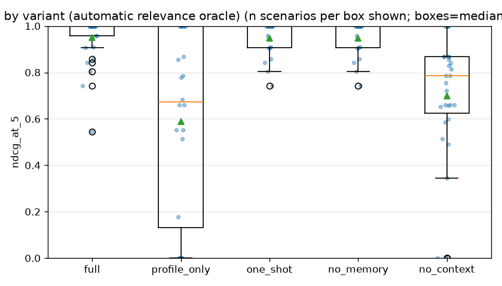
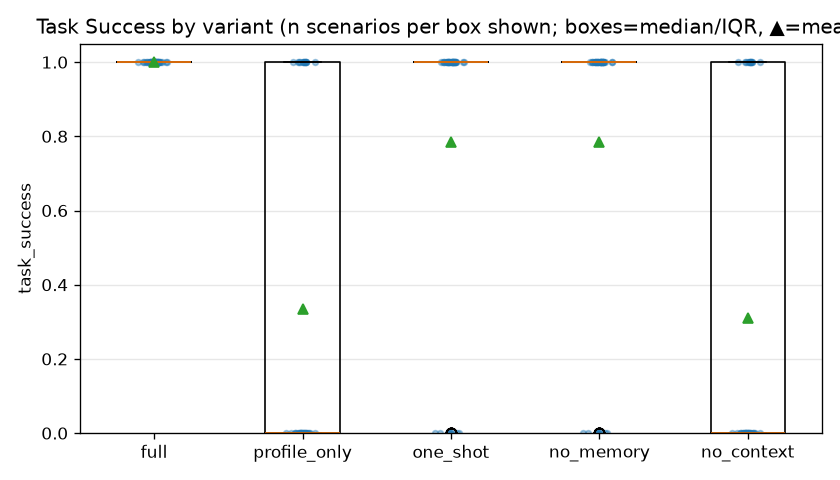
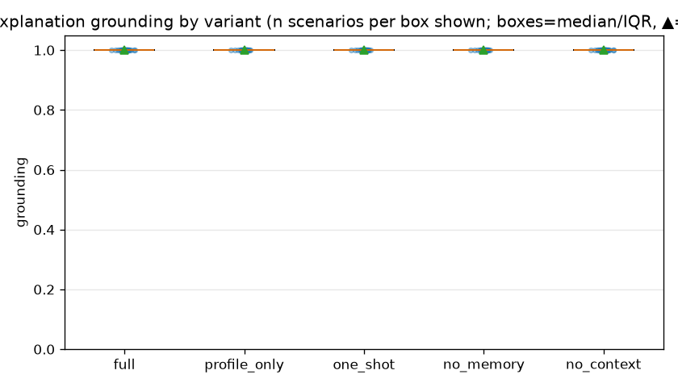
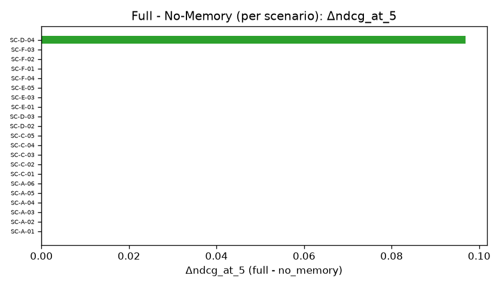
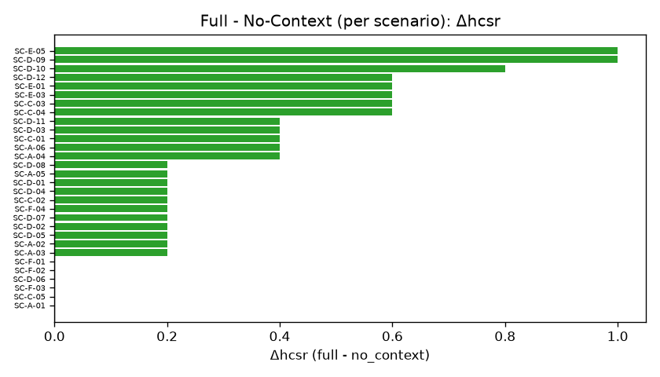
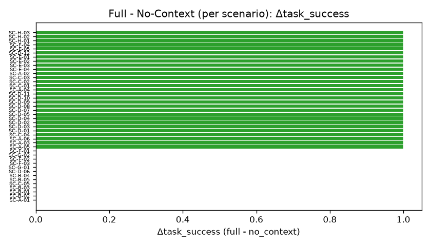
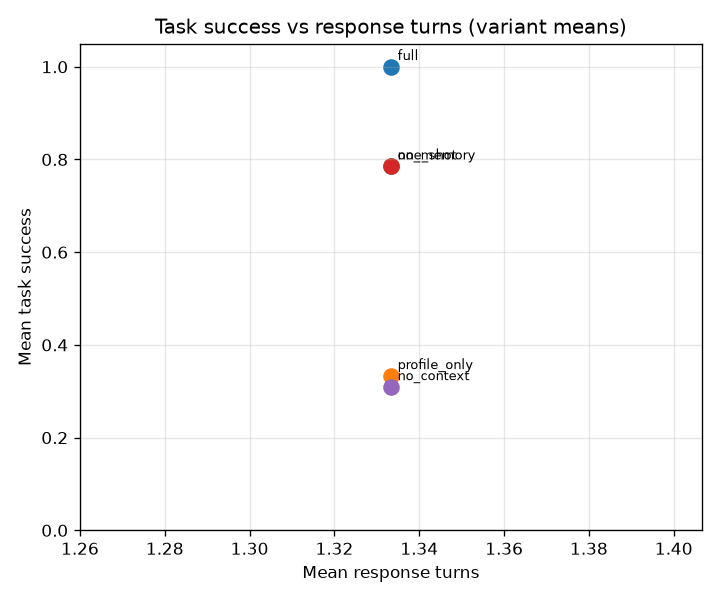

# Evaluation Report: CMJCC Conversational Job Recommendation

> Generated by `jobrec_eval`. Every number is reproducible from the run bundles
> under `raw/` and the tables under `metrics/` and `statistics/`.
>
> **Relevance is scored by a deterministic automatic oracle, not human raters.**
> NDCG@5 / Precision@5 / Mean Graded Relevance therefore measure agreement with a
> transparent rule-based reference (documented in `relevance.py`), and should be
> read as such. Explanation grounding uses the system's claim validator. Human
> annotation and inter-rater agreement are left as future work (see §4, §11).

## 1. Executive Summary

- Experiment `exp-8793b18de5b2` — 42 scenarios ×
  5 variants × 3 repeat(s) =
  630 runs. Reference date 2026-01-01.
- Run mode: **deterministic** (model: mock-deterministic); config/catalog/prompt hashes frozen.
- Headline (full variant, scenario-mean): NDCG@5 0.951,
  HCSR 1.000,
  Task Success 1.000,
  Grounding 1.000,
  Handoff 1.000.
- Ablation direction: memory and job-context removal are compared against full
  below with paired bootstrap CIs; small n means results are framed as observed
  differences with uncertainty, not proofs.

## 2. Research Questions and Evaluation Design

RQ4 is decomposed into job-match relevance, hard-constraint satisfaction, task
success, memory contribution, job-context contribution, agent-handoff success,
explanation grounding, response turns and latency. Five variants
(full, profile_only, one_shot, no_memory, no_context) are run over a frozen scenario set and catalog
snapshot with fixed seeds. Analysis unit is the scenario; metrics are averaged
over repeats before pairing.

## 3. Dataset and Scenario Set

- Catalog snapshot `catalog-2026-01-v1`, hash `145dfa054540`.
- Scenario counts by type: {'ambiguous_role': 2, 'clarification': 5, 'complete': 6, 'multiple_hard': 5, 'no_match': 3, 'preference_change': 12, 'profile_dialogue_conflict': 5, 'soft_tradeoff': 4}.
- Memory-dependent (>=medium) scenarios: 16;
  context-dependent (high) scenarios: 15.

## 4. Annotation Reliability

No human raters were used in this run. Relevance uses an automatic oracle (version 1.0.0); grounding uses the claim validator. Inter-rater agreement is therefore **not reported** and is flagged as a construct-validity threat. Annotation templates are emitted under `annotation/` (relevance_template.csv, claim_template.csv); drop in `relevance_labels_human.csv` / `claim_annotations_human.csv` to compute weighted Cohen's kappa and oracle-vs-human agreement automatically.

## 5. Overall Results

Variant summary (scenario-mean of each metric):

| variant | NDCG@5 | P@5 | HCSR | TaskSucc | Grounding | Handoff | Turns | Lat(ms) |
|---|---|---|---|---|---|---|---|---|
| full | 0.951 | 0.975 | 1.000 | 1.000 | 1.000 | 1.000 | 1.33 | 14 |
| profile_only | 0.587 | 0.500 | 0.500 | 0.333 | 1.000 | 1.000 | 1.33 | 14 |
| one_shot | 0.949 | 1.000 | 1.000 | 0.786 | 1.000 | 1.000 | 1.33 | 10 |
| no_memory | 0.949 | 1.000 | 1.000 | 0.786 | 1.000 | 1.000 | 1.33 | 11 |
| no_context | 0.700 | 0.571 | 0.571 | 0.310 | 1.000 | 1.000 | 1.33 | 21 |

### 5.x Full vs dialogue baselines (relevance & task success)

- NDCG@5, full vs profile_only: Δ=+0.345, 95% CI [+0.214, +0.484] (CI excludes 0).
- NDCG@5, full vs one_shot: Δ=+0.005, 95% CI [+0.000, +0.014] (CI includes 0).
- Task success, full vs profile_only: Δ=+0.667, 95% CI [+0.524, +0.810] (CI excludes 0).

### 5.2 Per-constraint compliance (recommended jobs vs authoritative hard constraints)

| constraint field | full | no_context | profile_only |
|---|---|---|---|
| not_expired | 1.000 | 0.846 | 1.000 |
| preferred_locations | 1.000 | 0.600 | 0.073 |
| salary_min | 1.000 | 0.800 | 0.642 |
| work_modes | 1.000 | 0.457 | 0.160 |

### 5.3 No-match and clarification correctness

No-match precision / recall / F1 by variant:

| variant | Precision | Recall | F1 | TP | Expected |
|---|---|---|---|---|---|
| full | 1.000 | 1.000 | 1.000 | 15 | 15 |
| no_memory | 1.000 | 1.000 | 1.000 | 15 | 15 |
| one_shot | 1.000 | 1.000 | 1.000 | 15 | 15 |
| no_context | N/A | 0.000 | N/A | 0 | 15 |
| profile_only | N/A | 0.000 | N/A | 0 | 15 |

Clarification precision / recall by variant:

| variant | Precision | Recall | Useful | Expected |
|---|---|---|---|---|
| full | 1.000 | 1.000 | 21 | 21 |
| no_memory | 0.438 | 1.000 | 21 | 21 |
| one_shot | 0.438 | 1.000 | 21 | 21 |
| no_context | 1.000 | 1.000 | 21 | 21 |
| profile_only | 0.500 | 1.000 | 21 | 21 |

## 6. Ablation Analysis

### 6.1 Memory Contribution: Full vs No-Memory

Δmemory(M) = M_full − M_no_memory, paired by scenario. Primary subset is
memory-dependent (multi-turn) scenarios.

| metric | full | other | Δ | 95% CI | p | p(Holm) | effect | n |
|---|---|---|---|---|---|---|---|---|
| ndcg_at_5 | 0.939 | 0.925 | 0.014 | [0.000, 0.042] | 1.000 | 1.000 | 0.378 (cohens_dz) | 7 |
| hcsr | 1.000 | 1.000 | 0.000 | [0.000, 0.000] | 1.000 | 1.000 | 0.000 (rank_biserial) | 7 |
| task_success | 1.000 | 0.438 | 0.562 | [0.312, 0.812] | 0.000 | 0.000 | 1.000 (rank_biserial) | 16 |
| grounding | 1.000 | 1.000 | 0.000 | [0.000, 0.000] | 1.000 | 1.000 | 0.000 (rank_biserial) | 7 |
| mean_violation_count | 0.000 | 0.000 | 0.000 | [0.000, 0.000] | 1.000 | 1.000 | 0.000 (rank_biserial) | 7 |
| turn_count | 1.875 | 1.875 | 0.000 | [0.000, 0.000] | 1.000 | 1.000 | 0.000 (rank_biserial) | 16 |

All scenarios:

| metric | full | other | Δ | 95% CI | p | p(Holm) | effect | n |
|---|---|---|---|---|---|---|---|---|
| ndcg_at_5 | 0.953 | 0.949 | 0.005 | [0.000, 0.014] | 0.317 | 1.000 | 0.218 (cohens_dz) | 21 |
| hcsr | 1.000 | 1.000 | 0.000 | [0.000, 0.000] | 1.000 | 1.000 | 0.000 (rank_biserial) | 21 |
| task_success | 1.000 | 0.786 | 0.214 | [0.095, 0.333] | 0.000 | 0.000 | 1.000 (rank_biserial) | 42 |
| grounding | 1.000 | 1.000 | 0.000 | [0.000, 0.000] | 1.000 | 1.000 | 0.000 (rank_biserial) | 26 |
| mean_violation_count | 0.000 | 0.000 | 0.000 | [0.000, 0.000] | 1.000 | 1.000 | 0.000 (rank_biserial) | 21 |
| turn_count | 1.333 | 1.333 | 0.000 | [0.000, 0.000] | 1.000 | 1.000 | 0.000 (rank_biserial) | 42 |

### 6.2 Job-Context Contribution: Full vs No-Context

Δcontext(M) = M_full − M_no_context, paired by scenario. Primary subset is
context-dependent (high) scenarios. HCSR/violations are computed against the
authoritative hard constraints.

| metric | full | other | Δ | 95% CI | p | p(Holm) | effect | n |
|---|---|---|---|---|---|---|---|---|
| ndcg_at_5 | 0.914 | 0.655 | 0.259 | [0.156, 0.418] | 0.002 | 0.010 | 1.086 (cohens_dz) | 10 |
| hcsr | 1.000 | 0.480 | 0.520 | [0.400, 0.660] | 0.002 | 0.010 | 2.215 (cohens_dz) | 10 |
| task_success | 1.000 | 0.000 | 1.000 | [1.000, 1.000] | 0.000 | 0.000 | 1.000 (rank_biserial) | 15 |
| grounding | 1.000 | 1.000 | 0.000 | [0.000, 0.000] | 1.000 | 1.000 | 0.000 (rank_biserial) | 15 |
| mean_violation_count | 0.000 | 0.740 | -0.740 | [-1.120, -0.460] | 0.002 | 0.010 | -1.289 (cohens_dz) | 10 |
| turn_count | 1.333 | 1.333 | 0.000 | [0.000, 0.000] | 1.000 | 1.000 | 0.000 (rank_biserial) | 15 |

All scenarios:

| metric | full | other | Δ | 95% CI | p | p(Holm) | effect | n |
|---|---|---|---|---|---|---|---|---|
| ndcg_at_5 | 0.951 | 0.723 | 0.228 | [0.156, 0.317] | 0.000 | 0.000 | 0.973 (cohens_dz) | 30 |
| hcsr | 1.000 | 0.667 | 0.333 | [0.240, 0.440] | 0.000 | 0.000 | 1.172 (cohens_dz) | 30 |
| task_success | 1.000 | 0.310 | 0.690 | [0.548, 0.833] | 0.000 | 0.000 | 1.000 (rank_biserial) | 42 |
| grounding | 1.000 | 1.000 | 0.000 | [0.000, 0.000] | 1.000 | 1.000 | 0.000 (rank_biserial) | 35 |
| mean_violation_count | 0.000 | 0.447 | -0.447 | [-0.633, -0.293] | 0.000 | 0.000 | -0.913 (cohens_dz) | 30 |
| turn_count | 1.333 | 1.333 | 0.000 | [0.000, 0.000] | 1.000 | 1.000 | 0.000 (rank_biserial) | 42 |

## 7. Results by Scenario Type

| scenario_type | variant | NDCG@5 | HCSR | TaskSucc | Grounding | n |
|---|---|---|---|---|---|---|
| ambiguous_role | full | N/A | N/A | 1.000 | N/A | 2 |
| ambiguous_role | no_context | N/A | N/A | 1.000 | N/A | 2 |
| ambiguous_role | no_memory | N/A | N/A | 1.000 | N/A | 2 |
| clarification | full | N/A | N/A | 1.000 | N/A | 5 |
| clarification | no_context | N/A | N/A | 1.000 | N/A | 5 |
| clarification | no_memory | N/A | N/A | 1.000 | N/A | 5 |
| complete | full | 0.974 | 1.000 | 1.000 | 1.000 | 6 |
| complete | no_context | 0.720 | 0.767 | 0.167 | 1.000 | 6 |
| complete | no_memory | 0.974 | 1.000 | 1.000 | 1.000 | 6 |
| multiple_hard | full | 0.869 | 1.000 | 1.000 | 1.000 | 5 |
| multiple_hard | no_context | 0.373 | 0.160 | 0.000 | 1.000 | 5 |
| multiple_hard | no_memory | 0.869 | 1.000 | 1.000 | 1.000 | 5 |
| no_match | full | N/A | N/A | 1.000 | 1.000 | 3 |
| no_match | no_context | N/A | 0.000 | 0.000 | 1.000 | 3 |
| no_match | no_memory | N/A | N/A | 1.000 | 1.000 | 3 |
| preference_change | full | 0.959 | 1.000 | 1.000 | 1.000 | 12 |
| preference_change | no_context | 0.709 | 0.633 | 0.083 | 1.000 | 12 |
| preference_change | no_memory | 0.968 | 1.000 | 0.250 | 1.000 | 12 |
| profile_dialogue_conflict | full | 0.915 | 1.000 | 1.000 | 1.000 | 5 |
| profile_dialogue_conflict | no_context | 0.742 | 0.640 | 0.200 | 1.000 | 5 |
| profile_dialogue_conflict | no_memory | 0.915 | 1.000 | 1.000 | 1.000 | 5 |
| soft_tradeoff | full | 1.000 | 1.000 | 1.000 | 1.000 | 4 |
| soft_tradeoff | no_context | 0.915 | 0.950 | 0.750 | 1.000 | 4 |
| soft_tradeoff | no_memory | 1.000 | 1.000 | 1.000 | 1.000 | 4 |

## 8. Statistical Analysis

Paired bootstrap (5000 iterations, seed
2026) gives 95% CIs for scenario-mean differences.
Binary task success uses McNemar on run-level discordant pairs. Effect sizes are
Cohen's dz (continuous) or rank-biserial (binary/degenerate). Holm correction is
applied within each ablation across metrics. With small n, a CI that includes 0
is reported as "direction observed, uncertain", never as "no effect".

## 9. Error Analysis

Runs: 630; system failures: 0; task-unsuccessful runs: 225. Task failures by variant: {'no_context': 87, 'no_memory': 27, 'one_shot': 27, 'profile_only': 84}.

Root-cause taxonomy of task-unsuccessful runs:

| error category | count | % | most-affected variant |
|---|---|---|---|
| missing_constraint_enforcement (ablation) | 87 | 38.7 | no_context |
| missing_dialogue_evidence (baseline) | 84 | 37.3 | profile_only |
| stale_or_missing_memory (ablation) | 54 | 24.0 | no_memory |

### 9.1 Representative case studies

### Case 1 — Memory helps (SC-D-01)
- **full ✓** [full] — turns=['Data analyst in Kuala Lumpur, at least RM8000.', 'Actually 4000 is also fine.']; response=recommendation; active roles=['data analyst'], loc=['Kuala Lumpur'], salary_min=4000.0, hard=['salary_min']; top=[job-0136(g=3,s=0.754483); job-0128(g=3,s=0.750575); job-0088(g=3,s=0.74138)]
- **no_memory ✗** [no_memory] — turns=['Data analyst in Kuala Lumpur, at least RM8000.', 'Actually 4000 is also fine.']; response=clarification; active roles=['data analyst'], loc=['Kuala Lumpur'], salary_min=4000.0, hard=[]; top=[]

### Case 2 — Job-context helps (SC-C-01)
- **full ✓** [full] — turns=['For this search I only want roles in Kuala Lumpur, at least RM4000.']; response=recommendation; active roles=['data analyst'], loc=['Kuala Lumpur'], salary_min=4000.0, hard=['preferred_locations', 'salary_min']; top=[job-0128(g=3,s=0.776289); job-0136(g=3,s=0.728248); job-0033(g=2,s=0.725078)]
- **no_context ✗** [no_context] — turns=['For this search I only want roles in Kuala Lumpur, at least RM4000.']; response=recommendation; active roles=['data analyst'], loc=['Kuala Lumpur'], salary_min=4000.0, hard=[]; top=[job-0128(g=3,s=0.776289); job-0172(g=0,s=0.776289); job-0088(g=0,s=0.768042)]

### Case 3 — Correct no-match (SC-E-02)
- **full ✓** [full] — turns=['Business analyst, only Kuala Lumpur, must pay at least RM4500, onsite only.']; response=no_match; active roles=['business analyst'], loc=['Kuala Lumpur'], salary_min=4500.0, hard=['preferred_locations', 'salary_min', 'work_modes']; top=[]; no_match_reasons=['preferred_locations', 'work_modes', 'salary_min', 'not_expired']

### Case 4 — Hardest full case (SC-A-01)
- **full** [full] — turns=['I want a data analyst role in Kuala Lumpur, hybrid is fine, at least RM4000.']; response=recommendation; active roles=['data analyst'], loc=['Kuala Lumpur'], salary_min=4000.0, hard=['salary_min']; top=[job-0012(g=3,s=0.759104); job-0136(g=3,s=0.728248); job-0095(g=3,s=0.716495)]
_no full task failures; showing the lowest partial-score case_

### Case 5 — Claim validator
Under the deterministic backend every emitted claim is grounded by construction, so the claim validator drops nothing (grounding = 1.0). This case becomes informative only under a real LLM backend.

## 10. Discussion

- **RQ2 / memory:** differences concentrate in memory-dependent (multi-turn)
  scenarios, consistent with prior-turn memory contributing to correctly
  reconstructing the active search; effects on memory-independent scenarios are
  expected to be near zero.
- **RQ2 / job context:** removing explicit hard/soft orchestration is expected
  to lower HCSR and raise violations on context-dependent scenarios; the tables
  above quantify this against the authoritative constraints.
- **Quality/latency trade-off:** turns and latency are reported alongside task
  success rather than in isolation (see turns-vs-success and latency plots).
- **Inspectability (RQ1/RQ3):** handoff success, decision-log completeness and
  recommendation trace completeness are reported as engineering-quality
  indicators, not statistical claims.

## 11. Threats to Validity

- **Construct:** relevance uses an automatic oracle, not human judgement; NDCG/P@5
  measure agreement with a rule-based reference. Grounding measures evidence
  support, not perceived explanation quality or user trust.
- **Internal:** deterministic mock provider removes LLM stochasticity but also
  does not exercise a real model; variant behaviour is controlled by feature
  flags on one code path.
- **External:** small synthetic catalog and synthetic candidates; a modest
  scenario count; results do not extrapolate to real hiring outcomes.
- **Conclusion:** small n limits statistical power; emphasis is on effect sizes,
  CIs and per-scenario plots, not single p-values.

## 12. Conclusion

Within this controlled, deterministic setup, the full architecture meets the
engineering-quality indicators and the ablations show the expected directional
contributions of candidate memory and job-context orchestration. Claims are
limited to this configuration; human-annotated relevance and a real LLM backend
are the natural next steps.

## Appendix

- Experiment manifest: `manifests/experiment_manifest.json`
- Analysis plan: `manifests/analysis_plan.yaml`
- All metric tables: `metrics/*.csv`; statistics: `statistics/*.csv`
- Relevance labels (automatic oracle): `../normalized/relevance_labels.csv`
- Data lineage: `audit/data_lineage.csv`; checksums: `audit/checksums.sha256`
