# Evaluation Report: CMJCC Conversational Job Recommendation

> Generated by `jobrec_eval`. Every number is reproducible from the run bundles under
> `_runs/exp-6db1e87daed5/<variant>/<scenario_id>/<run_index>/` and the tables under `metrics/` and
> `statistics/` inside this directory. The run-bundle tree is a sibling of this analysis
> output directory `exp-6db1e87daed5/`: both live under the pipeline's `--out-root`.
>
> **Relevance is scored by a deterministic automatic oracle, not human raters.**
> NDCG@5 / Precision@5 / Mean Graded Relevance therefore measure agreement with a versioned
> canonical reference, built by `oracle_reference.py` and graded by
> `relevance.py`. The reference is frozen with its own fingerprint and is
> independent of the experiment variants and of stochastic repeats, so every
> condition and both backends are scored against one yardstick. It is NOT
> independent of the system itself: its constraint values and hard/soft
> strengths are still produced by the system's own deterministic extraction,
> so the oracle remains a transparent proxy rather than ground truth (§12).
> Explanation grounding uses the system's claim validator.
> Human annotation and inter-rater agreement are left as future work (see §4, §12).

## 1. Executive Summary

- Experiment `exp-6db1e87daed5` — 42 scenarios ×
  3 variants × 3 repeat(s) =
  378 runs. Reference date 2026-01-01.
- Run mode: **hybrid**; provider `remote`; model(s) actually used, read from `model_calls.jsonl`: `gpt-5.5` via `remote` (622 calls);
  config/catalog/prompt hashes frozen.
- Completeness: every planned run produced a bundle (378 of 378).
- Headline (full variant, scenario-mean, with the denominator `n` each mean was taken
  over — they differ between metrics, see §5): NDCG@5 0.915 (n=37), HCSR 0.958 (n=38), Task Success 0.889 (n=42), Grounding 1.000 (n=42), Handoff 1.000 (n=42).
- Relevance source for NDCG@5 / Precision@5 / Mean Graded Relevance: **automatic oracle** (version 1.0.0), not human raters.
- Ablation direction: memory and job-context removal are compared against full
  below with paired bootstrap CIs; small n means results are framed as observed
  differences with uncertainty, not proofs.

## 2. Research Questions and Evaluation Design

RQ4 is decomposed into job-match relevance, hard-constraint satisfaction, task
success, memory contribution, job-context contribution, agent-handoff success,
explanation grounding, response turns and latency.
Three variants (full, no_memory, no_context) are run over a frozen scenario set and
catalog snapshot with fixed seeds. Analysis unit is the scenario; metrics are averaged
over repeats before pairing.

## 3. Dataset and Scenario Set

- Catalog snapshot `catalog-2026-01-v1`, hash `145dfa054540`.
- Scenario counts by type: ambiguous_role 2, clarification 5, complete 6, multiple_hard 5, no_match 3, preference_change 12, profile_dialogue_conflict 5, soft_tradeoff 4.
- Memory-dependent (>=medium) scenarios: 16;
  context-dependent (high) scenarios: 15.

### 3.1 Data quality of the frozen inputs

- Validated 200 catalog job(s) and 42 scenario(s) at reference date 2026-01-01: **0 error(s), 2 warning(s), 27 acknowledged test fixture(s)**.
- Errors block nothing here: the pipeline reports data-quality findings, and the standalone `validate` command is the gate that exits non-zero on an error-severity finding.
- Checks run: catalog_records, duplicate_job_ids, job_test_fixture_markers, scenario_records, duplicate_scenario_ids, scenario_hard_constraint_references, scenario_relevance_labels, no_match_scenarios_unsatisfiable.
- Findings by type: expired_deadline 27, no_match_scenario_constraint_satisfiable 2.
- Full report: `data_quality_report.json` (covered by `checksums.json`).

## 4. Annotation Reliability

No human raters were used in this run. Relevance uses an automatic oracle (version 1.0.0); grounding uses the claim validator. Inter-rater agreement is therefore **not reported** and is flagged as a construct-validity threat. Annotation templates are emitted under `annotation/` (relevance_template.csv, claim_template.csv); drop in `relevance_labels_human.csv` / `claim_annotations_human.csv` (with the `adjudicated` column filled in) to compute weighted Cohen's kappa, oracle-vs-human agreement and human-labelled ranking metrics automatically.

## 5. Overall Results

Relevance source for NDCG@5 / Precision@5 / Mean Graded Relevance: **automatic oracle** (version 1.0.0), not human raters.

Variant summary (scenario-mean of each metric):

| variant | NDCG@5 | P@5 | HCSR | TaskSucc | Grounding | Handoff | Turns | Lat(ms) |
|---|---|---|---|---|---|---|---|---|
| full | 0.915 | 0.973 | 0.958 | 0.889 | 1.000 | 1.000 | 1.45 | 10426 |
| no_memory | 0.889 | 0.964 | 0.971 | 0.738 | 1.000 | 1.000 | 1.45 | 9331 |
| no_context | 0.701 | 0.684 | 0.629 | 0.167 | 1.000 | 1.000 | 1.45 | 8752 |

Scenario denominator behind each mean above (`<metric>_n` in
`metrics/variant_summary.csv`; an empty cell means the frame carries no denominator for
that metric):

| variant | n(NDCG@5) | n(P@5) | n(HCSR) | n(TaskSucc) | n(Grounding) | n(Handoff) | n(Turns) | n(Lat(ms)) |
|---|---|---|---|---|---|---|---|---|
| full | 37 | 37 | 38 | 42 | 42 | 42 | 42 | 42 |
| no_memory | 30 | 30 | 30 | 42 | 35 | 42 | 42 | 42 |
| no_context | 38 | 38 | 42 | 42 | 42 | 42 | 42 | 42 |

**Read the denominators before the means.** The ranking metrics — NDCG@5, P@5, HCSR and
the graded-relevance mean — are averaged over the scenarios where the variant actually
returned a ranked list, and over those only. A variant that abandons a dialogue or
declines to answer returns no list on those scenarios, so it carries a SMALLER
denominator, and the scenarios it loses are exactly the hardest ones: the ambiguous
cases whose clarification it never resolved. A higher ranking mean on a smaller
denominator is therefore survivorship, NOT better ranking, and must never be read as
that variant out-ranking `full`. **`grounding` carries the same caveat and for the same
reason:** it is averaged only over the runs that actually emitted a factual claim, and a
run that returns no recommendation registers no claims, so it has nothing to ground and
drops out of that denominator too. A perfect grounding value on a reduced denominator
therefore means FEWER claims were checked, NOT better-grounded explanations, and it is
never evidence that the variant explains itself as well as `full` does. `task_success` is
the metric defined on every scenario — an abandoned or declined scenario counts as a
failure there instead of dropping out — so `task_success` is the column to compare across
variants; the ranking columns are comparable only between variants whose `n` agree.

### 5.x Full vs dialogue baselines (relevance & task success)

_This analysis contains no dialogue-baseline variant, so there is no full-vs-baseline comparison to report._

`n` is the number of scenarios paired between the two variants, i.e. the scenarios on
which both returned a comparable value; a scenario the other variant abandoned forms no
pair and enters no Δ. A near-zero Δ against a variant whose ranking denominator is
reduced is therefore "not estimable on the scenarios that variant abandoned", not
evidence of equivalence.

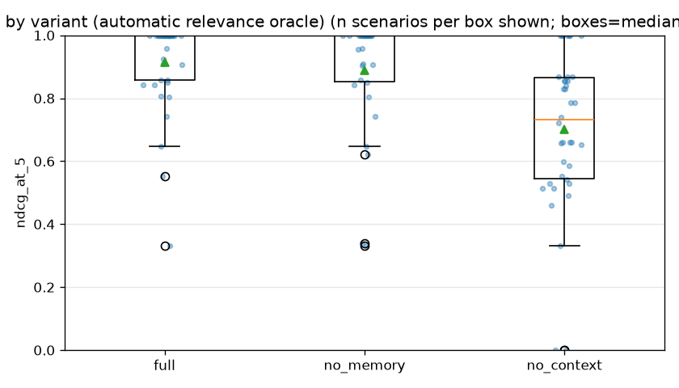
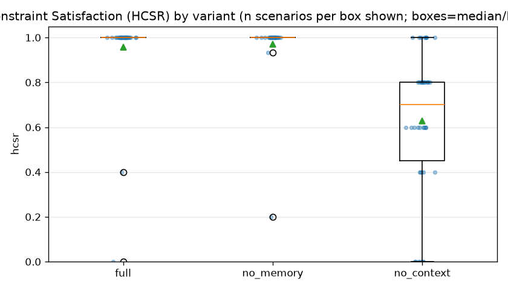
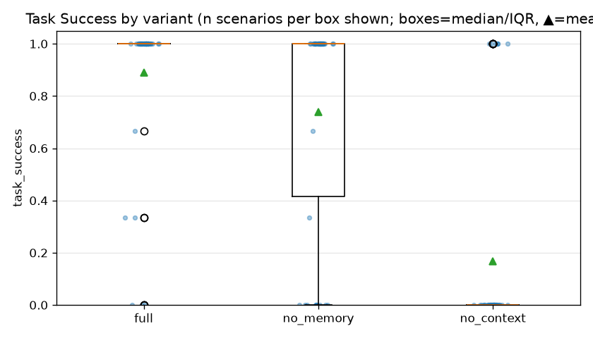
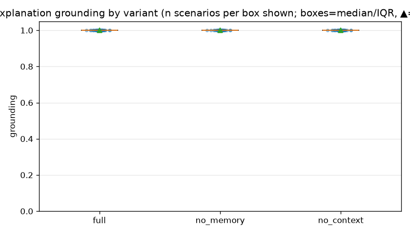

### 5.2 Per-constraint compliance (recommended jobs vs authoritative hard constraints)

| constraint field | full | no_memory | no_context |
|---|---|---|---|
| not_expired | 1.000 (n=501) | 1.000 (n=398) | 0.838 (n=630) |
| preferred_locations | 0.932 (n=74) | 1.000 (n=57) | 0.617 (n=180) |
| salary_min | 0.986 (n=366, unk 0%) | 0.996 (n=263, unk 0%) | 0.806 (n=495, unk 15%) |
| work_modes | 0.727 (n=33, unk 27%) | 0.636 (n=33, unk 27%) | 0.500 (n=90, unk 33%) |

Each cell is `rate (n=applicable)`, where `n` is the number of (recommended job,
constraint) pairs the check could be applied to. **The denominators differ by an order of
magnitude between variants**, because a variant that returns fewer recommendations offers
fewer pairs to check — so a perfect rate on a small `n` is not evidence of constraint
enforcement across the run, and the columns are only comparable at comparable `n`. Where a
cell also shows `unk`, that share of the denominator had a constraint value that could not
be determined; unknowns are counted as non-compliant in the denominator, so a large `unk`
means the rate is driven by missing data rather than by observed violations. Source:
`metrics/constraint_compliance.csv` (`pass`, `fail`, `unknown`, `applicable`,
`unknown_rate` per row).

### 5.3 No-match and clarification correctness

No-match precision / recall / F1 by variant:

| variant | Precision | Recall | F1 | TP | Expected |
|---|---|---|---|---|---|
| full | 0.778 | 0.933 | 0.848 | 14 | 15 |
| no_memory | 0.882 | 1.000 | 0.938 | 15 | 15 |
| no_context | N/A | 0.000 | N/A | 0 | 15 |

Clarification precision / recall by variant:

| variant | Precision | Recall | Useful | Expected |
|---|---|---|---|---|
| full | 1.000 | 0.714 | 15 | 21 |
| no_memory | 0.417 | 0.714 | 15 | 21 |
| no_context | 1.000 | 0.714 | 15 | 21 |

**Unit of the counts in both tables above: RUNS, not scenarios.** `TP`, `Expected` and
`Useful` count runs, so with `r` repeats per scenario an expectation held by `s` scenarios
appears as `s × r`. That is why an `Expected` of 126 over 42 scenarios is three repeats of
each, not 126 distinct scenarios — the precision and recall values themselves are
unaffected (numerator and denominator scale together), but the counts must not be read as
scenario evidence. Every statistical test in §6 and §8 pairs at the SCENARIO level
instead; see the analysis-unit note in §8.

### 5.4 Clarification efficiency and response-turn distribution

`response_turns` is interpreted **jointly with task success, never on its own**: asking
fewer questions while returning the wrong answer is NOT efficiency. The
`clarification_efficiency` score encodes exactly that — a run that skipped a *necessary*
clarification carries a skip penalty that dominates any turn-count or wasted-ask
advantage, so a short dialogue that guessed can never out-score a longer one that asked
the question it needed. Abandoning a dialogue *after* asking is likewise not efficiency:
a run that asked the necessary question but ended with it still pending (continuation
disabled, turn cap reached, the user unable to answer, or the repeated-slot guard) never
resolved the ambiguity it identified, and the score now reflects that with a separate
unresolved-dialogue penalty. The ordering the score implements is therefore *asked and
resolved* > *asked and abandoned* > *necessary clarification skipped*, and a shorter
dialogue cannot move a variant up that ordering. Read the turn columns below against the
Task Success column of §5 and §7, and read a low turn count as efficient only where task
success held up. Scores are on a penalty scale (higher = more efficient; the magnitudes
are not probabilities).

`NecRecall` is necessary clarification recall, `UnnecAsked` the unnecessary-ask count,
`NecMissed` the necessary clarifications that were skipped, `RepeatGuard` the runs where
the repeated-slot guard activated, `Abandoned` the runs that asked a clarification and
then ended with the question still pending, and `AnsweredRate` the share of asking runs
whose question the simulated user answered. A variant with a non-zero `Abandoned` count
is not to be read as efficient on the strength of `EffScore` alone.

| variant | MedTurns | IQR(Q1-Q3) | NecRecall | NecAsked | UnnecAsked | NecMissed | RepeatGuard | Abandoned | AnsweredRate | Tier res/aband/skip | MedEff | MeanEff | n(runs) |
|---|---|---|---|---|---|---|---|---|---|---|---|---|---|
| full | 1.00 | 1.00 (1.00-2.00) | 0.714 | 15 | 0 | 6 | 0 | 0 | 1.000 | 120/0/6 | -1.00 | -47620.50 | 126 |
| no_memory | 1.00 | 1.00 (1.00-2.00) | 0.714 | 15 | 21 | 6 | 0 | 21 | 0.583 | 99/21/6 | -1.00 | -47787.33 | 126 |
| no_context | 1.00 | 1.00 (1.00-2.00) | 0.714 | 15 | 0 | 6 | 0 | 0 | 1.000 | 120/0/6 | -1.00 | -47620.50 | 126 |

`Tier res/aband/skip` counts runs by efficiency TIER: asked-and-resolved, asked-then-abandoned, and necessary-clarification-skipped. This is the primary reading. `MedEff` is the median score (where the typical run sits) and `MeanEff` the mean. **`MeanEff` is a penalty scale, not a rate**: the skip tier costs 1e6 and the abandon tier 1e3, so a five-figure mean encodes the SHARE of runs in the worst tier, not a magnitude of inefficiency. Compare variants on the tier counts and the median; use the mean only for the ordering it guarantees (resolved > abandoned > skipped).

Sources: `metrics/clarification_efficiency.csv` (turn distribution, ask classification,
score), `metrics/clarification_metrics.csv` (recall, repeated-slot activations),
`metrics/run_metrics.csv` (`response_turns` and `clarification_efficiency` per run),
`metrics/variant_summary.csv` and `metrics/scenario_type_summary.csv` (aggregates).

### 5.5 Relevance source: automatic oracle vs adjudicated human labels

Relevance source for NDCG@5 / Precision@5 / Mean Graded Relevance: **automatic oracle** (version 1.0.0), not human raters.

One row per variant x ranking metric: `oracle` is the variant mean under the automatic oracle, `human` the variant mean under the adjudicated human labels, `Δ (human − oracle)` the human value minus the oracle value, and the two `n` columns the scenario counts behind each mean. The primary results in §5-§7 are the **oracle** column.

| variant | metric | oracle | human | Δ (human − oracle) | n(oracle) | n(human) |
|---|---|---|---|---|---|---|
| full | ndcg_at_5 | 0.915 | N/A | N/A | 37 | N/A |
| full | precision_at_5 | 0.973 | N/A | N/A | 37 | N/A |
| full | mean_graded_relevance | 2.717 | N/A | N/A | 37 | N/A |
| no_memory | ndcg_at_5 | 0.889 | N/A | N/A | 30 | N/A |
| no_memory | precision_at_5 | 0.964 | N/A | N/A | 30 | N/A |
| no_memory | mean_graded_relevance | 2.649 | N/A | N/A | 30 | N/A |
| no_context | ndcg_at_5 | 0.701 | N/A | N/A | 38 | N/A |
| no_context | precision_at_5 | 0.684 | N/A | N/A | 38 | N/A |
| no_context | mean_graded_relevance | 1.963 | N/A | N/A | 38 | N/A |

The `human` and Δ cells are empty because no adjudicated human labels were available for this run (searched `evaluation\data\relevance_labels_human.csv`). Nothing is imputed in their place: an empty cell means unmeasured, and requesting `--relevance-source human` in this state fails the run rather than reporting the oracle under a human heading.

Retrieval recall (`metrics/retrieval_metrics.csv`) is computed against the **automatic oracle in both modes**, on purpose: recall needs the full-catalog label universe, and human judgements exist only for returned pairs, which would make recall@pool trivially near 1.000. This is recorded as `retrieval_recall_relevance_source` in `manifests/analysis_plan.yaml`.

Source: `metrics/relevance_source_comparison.csv`.

### 5.6 Retrieval layer, top-k sensitivity and extraction source

**Retrieval layer.** Pool sizes, retrieval scores and the empty-recall fallback, per variant. `recall@pool` and `relevant coverage` are computed against the automatic-oracle label universe in both relevance modes; they read `N/A` when no labelled scenario returned a pool to score.

| variant | runs w/ retrieval | mean recalled | mean pool | mean score | full-catalog fallback | median lat(ms) | recall@pool | relevant coverage | retr err | rank err |
|---|---|---|---|---|---|---|---|---|---|---|
| full | 126 | 198.429 | 50.000 | 0.708 | 0.000 | 7.579 | 0.559 | 0.974 | 0.024 | 0.032 |
| no_context | 126 | 198.429 | 50.000 | 0.708 | 0.000 | 7.566 | 0.559 | 0.974 | 0.024 | 0.024 |
| no_memory | 105 | 198.314 | 50.000 | 0.707 | 0.000 | 7.303 | 0.561 | 0.968 | 0.029 | 0.019 |

Source: `metrics/retrieval_metrics.csv`.

**Ranking-feature contributions (variant `full`, top-k results).** `share of total` is the feature's mean contribution divided by the mean total score, so a feature with weight 0 or no applicable jobs contributes 0 by construction rather than by failing.

| ranking feature | mean weight | mean norm score | mean contribution | share of total | inactive jobs | dominant explanation |
|---|---|---|---|---|---|---|
| role_match | 0.279 | 0.886 | 0.247 | 0.338 | 0 | role_exact |
| required_skill_match | 0.279 | 0.608 | 0.171 | 0.235 | 49 | required_skill_coverage |
| location_preference | 0.106 | 0.701 | 0.078 | 0.107 | 150 | location_match |
| salary_preference | 0.080 | 0.599 | 0.064 | 0.088 | 134 | salary_meets_min |
| experience_fit | 0.078 | 0.813 | 0.064 | 0.087 | 45 | experience_in_range |
| preferred_skill_match | 0.112 | 0.508 | 0.057 | 0.077 | 100 | preferred_skill_coverage |
| work_mode_preference | 0.065 | 0.460 | 0.049 | 0.067 | 221 | work_mode_not_specified |
| industry_preference | 0.000 | 0.000 | 0.000 | 0.000 | 501 | industry_not_specified |

Source: `metrics/topk_contribution.csv` (also carries the per-rank breakdown and the other variants).

**Extraction source.** How each variant's constraint fields were obtained. Under the deterministic backend `rule share` is 1.0 by construction and the model columns are 0; under a hybrid backend this table is where the model's share, its schema-repair rate and its fallbacks to the rule extractor are read.

| variant | fields | rule share | model share | repaired | rule fallback | unresolved | schema failure | fallback rate |
|---|---|---|---|---|---|---|---|---|
| full | 528 | 0.205 | 0.795 | 9 | 0 | 0 | 0.017 | 0.000 |
| no_context | 532 | 0.203 | 0.797 | 2 | 0 | 0 | 0.004 | 0.000 |
| no_memory | 425 | 0.000 | 1.000 | 15 | 0 | 0 | 0.035 | 0.000 |

Source: `metrics/extraction_source_metrics.csv` (also carries the per-scenario-type scope).

## 6. Ablation Analysis

Each ablation isolates a single framework mechanism (candidate memory or
job-context orchestration) while holding catalog, scenarios, prompts, model
settings, top-k, pool size, ranking weights and seeds fixed across the compared
variants. Every Δ reported below is therefore read as the **contribution of that
framework mechanism under the controlled prototype instantiation** — an
attribution to a specific mechanism as instantiated in this prototype, not a
general property of the mechanism and not a claim of superiority over any
external framework.

Relevance source for NDCG@5 / Precision@5 / Mean Graded Relevance: **automatic oracle** (version 1.0.0), not human raters.

### 6.1 Memory Contribution: Full vs No-Memory

Δmemory(M) = M_full − M_no_memory, paired by scenario. Primary subset is
memory-dependent (multi-turn) scenarios. Each Δmemory is framed as the
candidate-memory mechanism's contribution under the controlled prototype
instantiation, not as evidence of comprehensive superiority over external
frameworks.

| metric | full | other | Δ | 95% CI | p | p(Holm) | effect | n |
|---|---|---|---|---|---|---|---|---|
| ndcg_at_5 | 0.903 | 0.864 | 0.039 | [0.005, 0.093] | 0.250 | 1.000 | 0.537 (cohens_dz) | 9 |
| hcsr | 0.933 | 0.904 | 0.030 | [0.000, 0.074] | 0.500 | 1.000 | 0.438 (cohens_dz) | 9 |
| task_success | 0.875 | 0.500 | 0.375 | [0.125, 0.625] | 0.031 | 0.188 | 1.000 (rank_biserial) | 16 |
| grounding | 1.000 | 1.000 | 0.000 | [0.000, 0.000] | 1.000 | 1.000 | 0.000 (rank_biserial) | 9 |
| mean_violation_count | 0.067 | 0.096 | -0.030 | [-0.074, 0.000] | 0.500 | 1.000 | -0.438 (cohens_dz) | 9 |
| turn_count | 1.875 | 1.875 | 0.000 | [0.000, 0.000] | 1.000 | 1.000 | 0.000 (rank_biserial) | 16 |

`task_success` is the **scenario-level binary** (repeats collapsed by majority vote, even-repeat ties → 0) in every column of its row, including the Δ and the CI. For reference, the mean success RATE over repeats is 0.896 (full) vs 0.479 (Δ 0.417); that is a different estimand and is not what the test above was computed on.

All scenarios:

| metric | full | other | Δ | 95% CI | p | p(Holm) | effect | n |
|---|---|---|---|---|---|---|---|---|
| ndcg_at_5 | 0.909 | 0.889 | 0.020 | [-0.006, 0.054] | 0.225 | 0.899 | 0.232 (cohens_dz) | 30 |
| hcsr | 0.980 | 0.971 | 0.009 | [0.000, 0.024] | 0.180 | 0.899 | 0.233 (cohens_dz) | 30 |
| task_success | 0.881 | 0.738 | 0.143 | [0.048, 0.262] | 0.031 | 0.188 | 1.000 (rank_biserial) | 42 |
| grounding | 1.000 | 1.000 | 0.000 | [0.000, 0.000] | 1.000 | 1.000 | 0.000 (rank_biserial) | 35 |
| mean_violation_count | 0.020 | 0.029 | -0.009 | [-0.024, 0.000] | 0.180 | 0.899 | -0.233 (cohens_dz) | 30 |
| turn_count | 1.452 | 1.452 | 0.000 | [0.000, 0.000] | 1.000 | 1.000 | 0.000 (rank_biserial) | 42 |

`task_success` is the **scenario-level binary** (repeats collapsed by majority vote, even-repeat ties → 0) in every column of its row, including the Δ and the CI. For reference, the mean success RATE over repeats is 0.889 (full) vs 0.738 (Δ 0.151); that is a different estimand and is not what the test above was computed on.

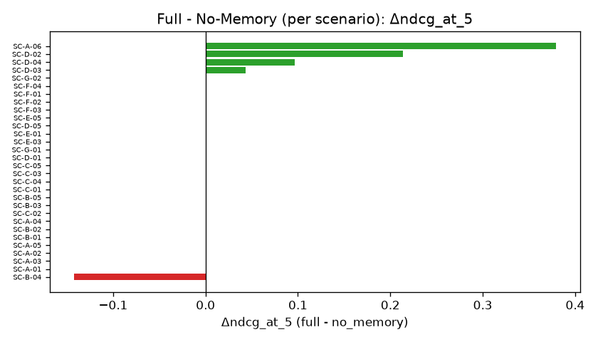
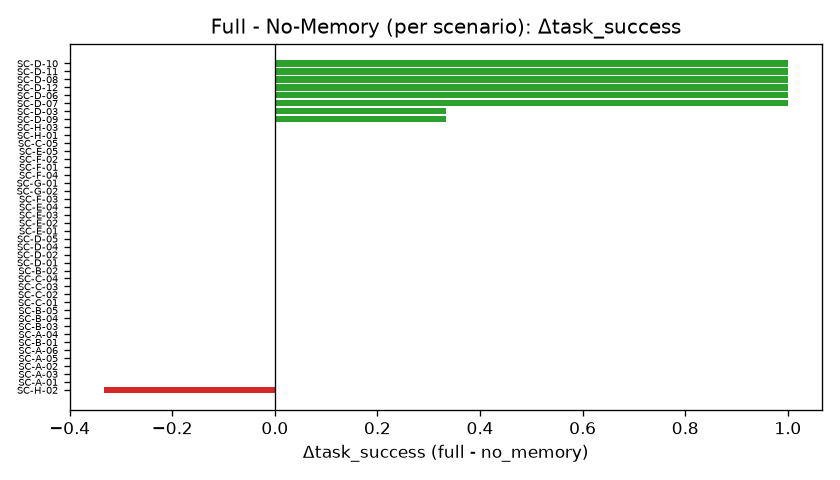
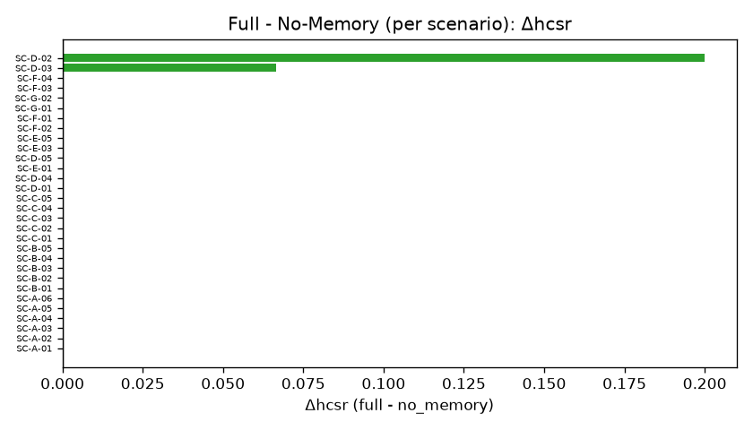

### 6.2 Job-Context Contribution: Full vs No-Context

Δcontext(M) = M_full − M_no_context, paired by scenario. Primary subset is
context-dependent (high) scenarios. HCSR/violations are computed against the
authoritative hard constraints. Each Δcontext is framed as the job-context
orchestration mechanism's contribution under the controlled prototype
instantiation, not as a claim of comprehensive superiority over external
frameworks.

| metric | full | other | Δ | 95% CI | p | p(Holm) | effect | n |
|---|---|---|---|---|---|---|---|---|
| ndcg_at_5 | 0.899 | 0.648 | 0.251 | [0.142, 0.414] | 0.002 | 0.010 | 1.030 (cohens_dz) | 10 |
| hcsr | 0.909 | 0.455 | 0.455 | [0.309, 0.600] | 0.002 | 0.010 | 1.685 (cohens_dz) | 11 |
| task_success | 1.000 | 0.000 | 1.000 | [1.000, 1.000] | 6.10e-05 | 3.66e-04 | 1.000 (rank_biserial) | 15 |
| grounding | 1.000 | 1.000 | 0.000 | [0.000, 0.000] | 1.000 | 1.000 | 0.000 (rank_biserial) | 15 |
| mean_violation_count | 0.182 | 0.782 | -0.600 | [-0.982, -0.273] | 0.005 | 0.015 | -0.930 (cohens_dz) | 11 |
| turn_count | 1.333 | 1.333 | 0.000 | [0.000, 0.000] | 1.000 | 1.000 | 0.000 (rank_biserial) | 15 |

`task_success` is the **scenario-level binary** (repeats collapsed by majority vote, even-repeat ties → 0) in every column of its row, including the Δ and the CI. For reference, the mean success RATE over repeats is 0.978 (full) vs 0.000 (Δ 0.978); that is a different estimand and is not what the test above was computed on.

All scenarios:

| metric | full | other | Δ | 95% CI | p | p(Holm) | effect | n |
|---|---|---|---|---|---|---|---|---|
| ndcg_at_5 | 0.915 | 0.720 | 0.194 | [0.138, 0.260] | 4.20e-06 | 1.68e-05 | 1.008 (cohens_dz) | 37 |
| hcsr | 0.958 | 0.695 | 0.263 | [0.195, 0.337] | 2.53e-06 | 1.27e-05 | 1.153 (cohens_dz) | 38 |
| task_success | 0.881 | 0.167 | 0.714 | [0.571, 0.857] | 1.86e-09 | 1.12e-08 | 1.000 (rank_biserial) | 42 |
| grounding | 1.000 | 1.000 | 0.000 | [0.000, 0.000] | 1.000 | 1.000 | 0.000 (rank_biserial) | 42 |
| mean_violation_count | 0.068 | 0.389 | -0.321 | [-0.463, -0.205] | 6.93e-06 | 2.08e-05 | -0.784 (cohens_dz) | 38 |
| turn_count | 1.452 | 1.452 | 0.000 | [0.000, 0.000] | 1.000 | 1.000 | 0.000 (rank_biserial) | 42 |

`task_success` is the **scenario-level binary** (repeats collapsed by majority vote, even-repeat ties → 0) in every column of its row, including the Δ and the CI. For reference, the mean success RATE over repeats is 0.889 (full) vs 0.167 (Δ 0.722); that is a different estimand and is not what the test above was computed on.

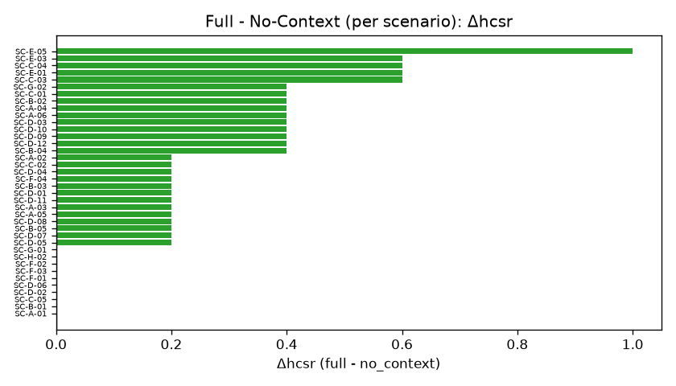
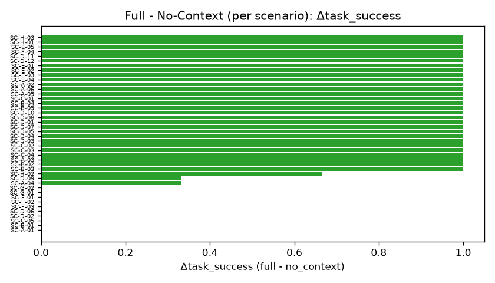
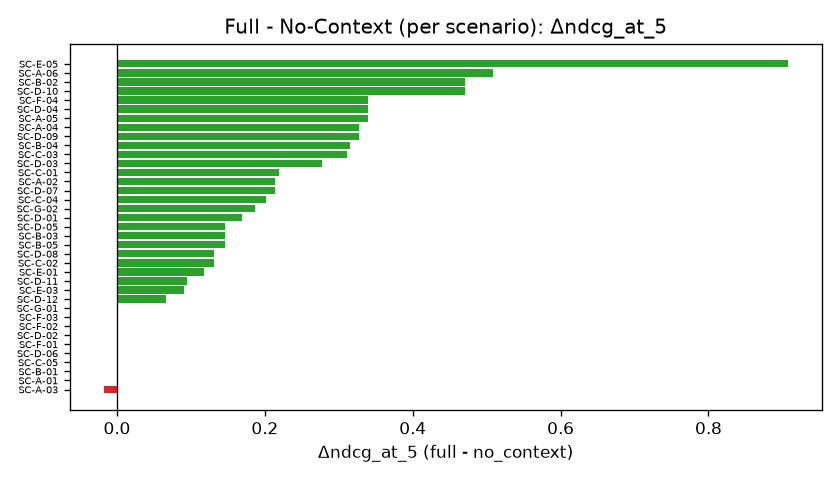

### 6.3 Process-measure contributions (secondary outcome family)

Δ for the two process measures — **response turns** and **clarification efficiency** —
reported as a SEPARATE, secondary outcome family. Holm correction is applied within each
family independently (see §8), so these rows do not alter a single p-value in §6.1/§6.2:
the pre-registered primary family in `manifests/analysis_plan.yaml`
(`primary_outcomes`) is corrected over its own metrics only, and this family
(`secondary_outcomes`) over its own. Rows are tagged with a `family` column in
`metrics/memory_contribution.csv` and `metrics/context_contribution.csv`, so nothing is
counted twice.

These Δ values carry the same reading as every other Δ here: the contribution of that
framework mechanism under the controlled prototype instantiation, not a general property
of the mechanism and not a claim about any external framework. A negative Δ on response
turns means the full variant used FEWER turns; it is only a gain where task success in
§6.1/§6.2 did not fall, because fewer questions with a wrong answer is not efficiency.

Δmemory, memory-dependent scenarios:

| metric | full | other | Δ | 95% CI | p | p(Holm) | effect | n |
|---|---|---|---|---|---|---|---|---|
| response_turns | 1.875 | 1.875 | 0.000 | [0.000, 0.000] | 1.000 | 1.000 | 0.000 (rank_biserial) | 16 |
| clarification_efficiency | -1.875 | -439.812 | 437.938 | [187.688, 688.188] | 0.008 | 0.016 | 0.854 (cohens_dz) | 16 |

Δmemory, all scenarios:

| metric | full | other | Δ | 95% CI | p | p(Holm) | effect | n |
|---|---|---|---|---|---|---|---|---|
| response_turns | 1.452 | 1.452 | 0.000 | [0.000, 0.000] | 1.000 | 1.000 | 0.000 (rank_biserial) | 42 |
| clarification_efficiency | -47620.500 | -47787.333 | 166.833 | [71.500, 286.000] | 0.008 | 0.016 | 0.442 (cohens_dz) | 42 |

Δcontext, context-dependent scenarios:

| metric | full | other | Δ | 95% CI | p | p(Holm) | effect | n |
|---|---|---|---|---|---|---|---|---|
| response_turns | 1.333 | 1.333 | 0.000 | [0.000, 0.000] | 1.000 | 1.000 | 0.000 (rank_biserial) | 15 |
| clarification_efficiency | -1.333 | -1.333 | 0.000 | [0.000, 0.000] | 1.000 | 1.000 | 0.000 (rank_biserial) | 15 |

Δcontext, all scenarios:

| metric | full | other | Δ | 95% CI | p | p(Holm) | effect | n |
|---|---|---|---|---|---|---|---|---|
| response_turns | 1.452 | 1.452 | 0.000 | [0.000, 0.000] | 1.000 | 1.000 | 0.000 (rank_biserial) | 42 |
| clarification_efficiency | -47620.500 | -47620.500 | 0.000 | [0.000, 0.000] | 1.000 | 1.000 | 0.000 (rank_biserial) | 42 |

## 7. Results by Scenario Type

Relevance source for NDCG@5 / Precision@5 / Mean Graded Relevance: **automatic oracle** (version 1.0.0), not human raters.

| scenario_type | variant | NDCG@5 | HCSR | TaskSucc | Grounding | Turns | ClarEff | n |
|---|---|---|---|---|---|---|---|---|
| ambiguous_role | full | 0.490 | 1.000 | 0.000 | 1.000 | 1.00 | -1000001.00 | 2 |
| ambiguous_role | no_memory | 0.490 | 1.000 | 0.000 | 1.000 | 1.00 | -1000001.00 | 2 |
| ambiguous_role | no_context | 0.396 | 0.800 | 0.000 | 1.000 | 1.00 | -1000001.00 | 2 |
| clarification | full | 0.971 | 1.000 | 1.000 | 1.000 | 2.00 | -2.00 | 5 |
| clarification | no_memory | 1.000 | 1.000 | 1.000 | 1.000 | 2.00 | -2.00 | 5 |
| clarification | no_context | 0.756 | 0.760 | 0.200 | 1.000 | 2.00 | -2.00 | 5 |
| complete | full | 0.949 | 1.000 | 0.889 | 1.000 | 1.00 | -1.00 | 6 |
| complete | no_memory | 0.886 | 1.000 | 0.889 | 1.000 | 1.00 | -1.00 | 6 |
| complete | no_context | 0.720 | 0.767 | 0.167 | 1.000 | 1.00 | -1.00 | 6 |
| multiple_hard | full | 0.869 | 1.000 | 1.000 | 1.000 | 1.00 | -1.00 | 5 |
| multiple_hard | no_memory | 0.869 | 1.000 | 1.000 | 1.000 | 1.00 | -1.00 | 5 |
| multiple_hard | no_context | 0.373 | 0.160 | 0.000 | 1.000 | 1.00 | -1.00 | 5 |
| no_match | full | N/A | 0.000 | 0.889 | 1.000 | 1.00 | -1.00 | 3 |
| no_match | no_memory | N/A | N/A | 1.000 | 1.000 | 1.00 | -1.00 | 3 |
| no_match | no_context | N/A | 0.000 | 0.000 | 1.000 | 1.00 | -1.00 | 3 |
| preference_change | full | 0.927 | 0.950 | 0.861 | 1.000 | 2.17 | -2.17 | 12 |
| preference_change | no_memory | 0.840 | 0.827 | 0.306 | 1.000 | 2.17 | -586.08 | 12 |
| preference_change | no_context | 0.741 | 0.717 | 0.083 | 1.000 | 2.17 | -2.17 | 12 |
| profile_dialogue_conflict | full | 0.915 | 1.000 | 1.000 | 1.000 | 1.00 | -1.00 | 5 |
| profile_dialogue_conflict | no_memory | 0.915 | 1.000 | 1.000 | 1.000 | 1.00 | -1.00 | 5 |
| profile_dialogue_conflict | no_context | 0.742 | 0.640 | 0.200 | 1.000 | 1.00 | -1.00 | 5 |
| soft_tradeoff | full | 1.000 | 1.000 | 1.000 | 1.000 | 1.00 | -1.00 | 4 |
| soft_tradeoff | no_memory | 1.000 | 1.000 | 1.000 | 1.000 | 1.00 | -1.00 | 4 |
| soft_tradeoff | no_context | 0.915 | 0.950 | 0.750 | 1.000 | 1.00 | -1.00 | 4 |

`n` here is the number of scenarios OF THAT TYPE that the variant ran; it is NOT the
per-metric denominator, which is per (metric, variant) and is shown in the denominator
table in §5. A metric cell reading `N/A` therefore means that variant returned nothing to
score for that metric on those scenarios — the `n` beside it still counts the scenarios,
not the values that entered the mean.

## 8. Statistical Analysis

**Analysis unit.** `scenario_id` is the independent analysis unit. `repeat_index` is used
only for stability and variance analysis and is **never** treated as an independent
sample: repeats are collapsed within each scenario before anything is paired.
Deterministic runs default to one repeat per scenario; stochastic and hybrid runs may
repeat, and repeating them cannot enlarge the sample or shrink a p-value.

**Continuous metrics.** Metrics are averaged over repeats per scenario x variant, then
paired by `scenario_id`. Paired bootstrap (5000
iterations, seed 2026) gives 95% CIs for the scenario-mean
difference; the p-value is Wilcoxon signed-rank over the scenario pairs.

**Binary task success.** McNemar operates on **scenario-level paired binary outcomes**,
not on run-level pairs: within each scenario the repeats are collapsed to one binary by
majority vote (strictly more successes than failures -> 1), with even-repeat ties
resolving conservatively to not-success. The two variants are then paired on the
scenarios present in both, and the exact binomial test is applied to the discordant
scenario pairs. `n_pairs` is therefore the number of **validly paired scenarios**, not
the number of runs.

| comparison | scenarios | runs | repeats/scenario | valid pairs | discordant | n_pairs | p |
|---|---|---|---|---|---|---|---|
| full vs no_memory | 42 | 252 | 3 | 42 | 6 | 42 | 0.031 |
| full vs no_context | 42 | 252 | 3 | 42 | 30 | 42 | 1.86e-09 |

`runs` counts the runs on BOTH sides of the comparison (`scenarios` x
`repeats/scenario` x the two variants), so it exceeds `n_pairs` whenever repeats are
used. `n_pairs` equals `valid pairs`, which is a scenario count. `discordant` is the
number of scenario pairs the exact test is computed on.

**Effect sizes.** Cohen's dz for continuous metrics, rank-biserial for binary or
degenerate ones.

**Multiplicity.** Holm correction is applied within each ablation, within each scenario
subset, and **within each outcome family independently**: the pre-registered primary
family (§6.1/§6.2) and the secondary process-measure family (§6.3) are corrected
separately, so adding the process measures leaves every primary p-value unchanged. Both
families are recorded in `manifests/analysis_plan.yaml` as `primary_outcomes` and
`secondary_outcomes`.

With small n, a CI that includes 0 is reported as "direction observed, uncertain", never
as "no effect".

## 9. Error Analysis

Runs: 378; system failures: 0; task-unsuccessful runs: 152. Task failures by variant: full 14, no_context 105, no_memory 33.

Root-cause taxonomy of task-unsuccessful runs:

| error category | count | % | most-affected variant |
|---|---|---|---|
| missing_constraint_enforcement (ablation) | 102 | 67.1 | no_context |
| stale_or_missing_memory (ablation) | 21 | 13.8 | no_memory |
| other | 20 | 13.2 | full |
| no_match_misclassification | 6 | 3.9 | full |
| no_context_other | 3 | 2.0 | no_context |

### 9.1 Representative case studies

### Case 1 — Memory helps (SC-D-03)
- **full ✓** [full repeat 0] — turns=['Data analyst in Penang, at least RM4000.', 'Change that to Kuala Lumpur instead.']; response=recommendation; active roles=['data analyst'], loc=['Penang', 'Kuala Lumpur'], salary_min=4000.0, hard=['preferred_locations', 'salary_min']; top=[job-0031(g=3,s=0.77969); job-0053(g=3,s=0.77969); job-0128(g=3,s=0.774713)]
- **no_memory ✗** [no_memory repeat 2] — turns=['Data analyst in Penang, at least RM4000.', 'Change that to Kuala Lumpur instead.']; response=recommendation; active roles=['data analyst'], loc=['Kuala Lumpur'], salary_min=None, hard=['preferred_locations']; top=[job-0136(g=3,s=0.837662); job-0196(g=3,s=0.751078); job-0128(g=3,s=0.745454)]

### Case 2 — Job-context helps (SC-C-01)
- **full ✓** [full repeat 0] — turns=['For this search I only want roles in Kuala Lumpur, at least RM4000.']; response=recommendation; active roles=['data analyst'], loc=['Kuala Lumpur'], salary_min=4000.0, hard=['preferred_locations', 'salary_min']; top=[job-0128(g=3,s=0.776289); job-0136(g=3,s=0.728248); job-0033(g=2,s=0.725078)]
- **no_context ✗** [no_context repeat 0] — turns=['For this search I only want roles in Kuala Lumpur, at least RM4000.']; response=recommendation; active roles=['data analyst'], loc=['Kuala Lumpur'], salary_min=4000.0, hard=[]; top=[job-0128(g=3,s=0.776289); job-0172(g=0,s=0.776289); job-0088(g=0,s=0.768042)]

### Case 3 — Correct no-match (SC-E-02)
- **full ✓** [full repeat 0] — turns=['Business analyst, only Kuala Lumpur, must pay at least RM4500, onsite only.']; response=no_match; active roles=['business analyst'], loc=['Kuala Lumpur'], salary_min=4500.0, hard=['preferred_locations', 'salary_min', 'target_roles', 'work_modes']; top=[]; no_match_reasons=['preferred_locations', 'work_modes', 'salary_min', 'not_expired']

### Case 4 — Full failure (SC-A-04)
- **full ✗** [full repeat 0] — turns=['Software engineer role in Kuala Lumpur, hybrid, at least RM5000.']; response=no_match; active roles=['software engineer'], loc=['Kuala Lumpur'], salary_min=5000.0, hard=['preferred_locations', 'salary_min', 'target_roles', 'work_modes']; top=[]; no_match_reasons=['preferred_locations', 'work_modes', 'salary_min', 'not_expired']
_full did not meet the task-success rule for this scenario_

### Case 5 — Claim validator
No claim was blocked in this run (hybrid backend), so the claim validator drops nothing (grounding = 1.0). Note that this is by construction rather than a property of the model: claims are assembled from evidence records and the explanation text is not model-generated, so the validator has nothing ungrounded to reject. A backend that let the model write claim text is where this case becomes informative.

## 10. Fault-Injection Robustness (separate robustness experiment)

This section is **deliberately kept separate from the main experiment results in §5-§7**.
The main experiment measures the system on well-formed scenarios; this section reports
whether the system detects, rejects or recovers from deliberately malformed inputs. The
two are different experiments over different inputs and are never averaged together.

Two consequences of that separation, stated explicitly so the numbers are not
misread:

- **A grounding rate of 1.000 in the main experiment is legitimate, not a defect.** Every
  factual claim in a well-formed run resolves to registered evidence because the claim
  validator drops the ones that do not, so there is nothing left to be unsupported. The
  same holds for handoff success.
- **Failure samples are NOT mixed into the main experiment to drag a metric below
  1.000.** Doing so would corrupt the main measurement to make a robustness point. The
  evidence that ungrounded claims and invalid handoffs really are caught comes from the
  fault-injection suite below, which shows both rates strictly under 1.000 over a
  failure-containing set.

### 10.1 Failure-path rates over the loaded runs

| metric | source | numerator | denominator | value |
|---|---|---|---|---|
| failure_detection_rate | run_metrics | 0 | 0 | N/A (empty denominator) |
| recovery_success_rate | run_metrics | 0 | 0 | N/A (empty denominator) |
| grounding_rate | run_bundles | 7626 | 7626 | 1.000 |
| handoff_success_rate | run_bundles | 1827 | 1827 | 1.000 |

**The loaded runs injected no faults, so the detection and recovery rates read N/A, not 0.0 and not 1.000.** An empty denominator is reported as N/A on purpose: a main-experiment run set contains no injected faults, and printing 0.0 detected or a perfect recovery over zero observations would be misleading. The robustness evidence therefore comes from the fault-injection suite enumerated in §10.2, not from this run set.

Source: `metrics/failure_metrics.csv` (one row per rate, with the numerator and
denominator behind it).

### 10.2 Fault classes covered by the robustness suite

The fault-injection helpers live in `tests/support/fault_injection.py`; the assertions
live in `tests/unit/test_failure_paths.py` (per-case) and
`tests/integration/test_failure_metrics.py` (aggregate rates over a failure-containing
set, including a generated-set property test). The classes covered are:

| fault class | injected as | asserted outcome |
|---|---|---|
| invalid evidence id | a claim citing an id registered nowhere | claim flagged unsupported, never presented |
| missing evidence source | a claim carrying no evidence ids | claim flagged unsupported |
| wrong-field evidence | an id for a different field of the same job | does not resolve; claim rejected |
| partially grounded claim | one resolvable + one dangling id | rejected as a whole (grounding is all-or-nothing) |
| unsupported salary claim | salary text with no supporting evidence | flagged unsupported |
| unsupported location claim | location text with no supporting evidence | flagged unsupported |
| unsupported skill claim | skill text with no supporting evidence | flagged unsupported |
| schema-invalid handoff | out-of-vocabulary `status`; unknown extra field | handoff rejected, offending field named |
| missing-field handoff | each required field omitted in turn | handoff rejected, every loss reported |
| agent exception | an agent raising mid-turn | failed run with an error response holding no claims |
| timeout + retry | provider raising `LLMTimeout` for the first N calls | absorbed by the bounded retry; budget is finite |
| partial failure + recovery | timeout on the first model call | recovers on the retry, or falls back to the rule extractor; run completes |

Also asserted at the aggregate level: a run containing a non-validated handoff is never
scored a success, every supported claim resolves to a registered evidence id, and over a
failure-containing set both `grounding_rate` and `handoff_success_rate` are strictly below
1.000 while a happy-path-only set reports N/A for detection and recovery.

## 11. Discussion

- **RQ2 / memory:** differences concentrate in memory-dependent (multi-turn)
  scenarios, consistent with prior-turn memory contributing to correctly
  reconstructing the active search; effects on memory-independent scenarios are
  expected to be near zero.
- **RQ2 / job context:** removing explicit hard/soft orchestration is expected
  to lower HCSR and raise violations on context-dependent scenarios; the tables
  above quantify this against the authoritative constraints.
- **Quality/latency trade-off:** turns and latency are reported alongside task
  success rather than in isolation (see turns-vs-success and latency plots).
- **Inspectability (RQ1/RQ3):** handoff success, decision-log completeness and
  recommendation trace completeness are reported as engineering-quality
  indicators, not statistical claims.

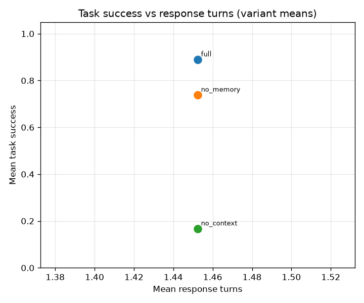
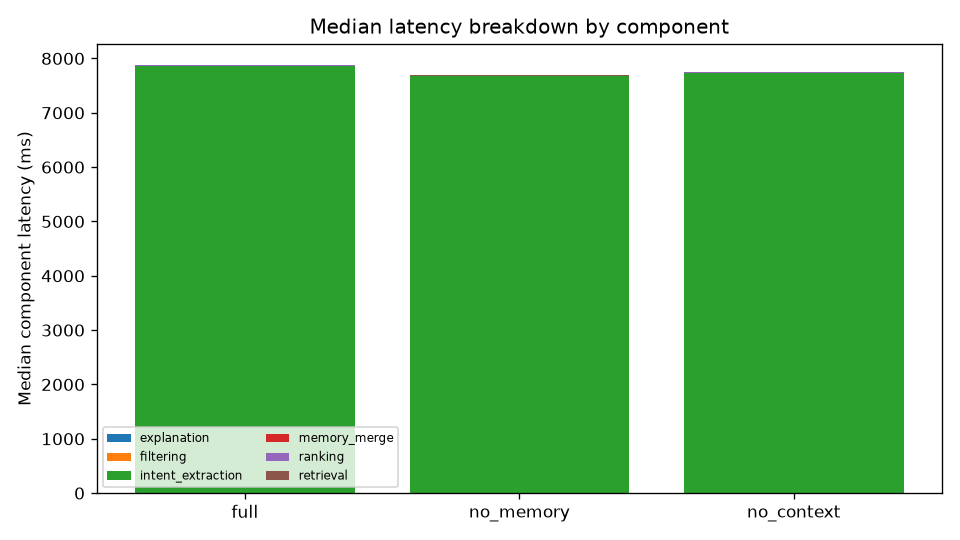

## 12. Threats to Validity

- **Construct:** relevance uses an automatic oracle, not human judgement; NDCG/P@5
  measure agreement with a rule-based reference. That reference is canonical --
  frozen, fingerprinted, and identical across variants, repeats and backends, so
  no condition is graded against its own output and no repeat decides the labels
  -- but it is derived by the system's OWN deterministic extraction, so the
  hard/soft strength of a stated constraint is the extractor's reading of the
  utterance rather than an independently declared truth. The residual dependency
  is therefore stabilised, not eliminated: a metric here measures agreement with
  that reading. Grounding measures evidence support, not perceived explanation
  quality or user trust.
- **Internal:** a real model backend (hybrid, `gpt-5.5`) is
  exercised, so responses are stochastic: repeats measure that variance rather
  than adding independent samples, and a single repeat cannot be read as the
  system's behaviour. Variant behaviour is controlled by feature flags on one
  code path, and every model call is recorded so the run is replayable.
- **External:** small synthetic catalog and synthetic candidates; a modest
  scenario count; results do not extrapolate to real hiring outcomes.
- **Conclusion:** small n limits statistical power; emphasis is on effect sizes,
  CIs and per-scenario plots, not single p-values.

## 13. Conclusion

Within this controlled setup on a real model backend (hybrid), the full architecture meets the
engineering-quality indicators and the ablations show the expected directional
contributions of candidate memory and job-context orchestration. These results
attribute observed differences to specific framework mechanisms under the
controlled prototype instantiation; they do not state or imply comprehensive
superiority over any existing external framework. Claims are limited to this configuration; human-annotated relevance is the natural next step, the real-model backend having already been exercised here.

## Appendix

- Experiment manifest: `manifests/experiment_manifest.json`
- Analysis plan: `manifests/analysis_plan.yaml` (`primary_outcomes` +
  `secondary_outcomes`; Holm is applied within each family)
- All metric tables: `metrics/*.csv`; statistics: `statistics/*.csv`
- Clarification efficiency + response-turn distribution:
  `metrics/clarification_efficiency.csv`
- Failure-path rates: `metrics/failure_metrics.csv`
- Data-quality report: `data_quality_report.json`
- Relevance labels (automatic oracle, version 1.0.0): `../normalized/relevance_labels.csv`
- Oracle vs human comparison: `metrics/relevance_source_comparison.csv`
- Relevance source used for the reported ranking metrics: `automatic_oracle`; retrieval recall labels: `automatic_oracle`
- Data lineage: `audit/data_lineage.csv`; checksums: `checksums.json`
  (verify with `python -m jobrec_eval.cli verify <output_dir>`)
